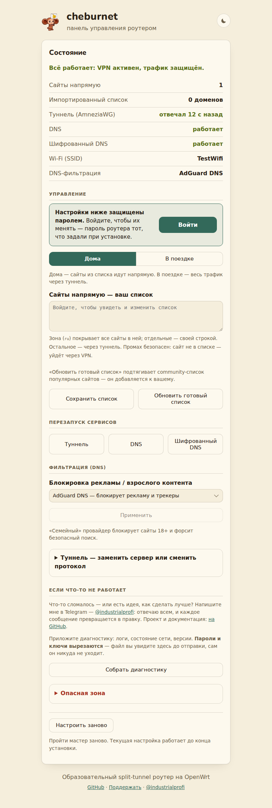
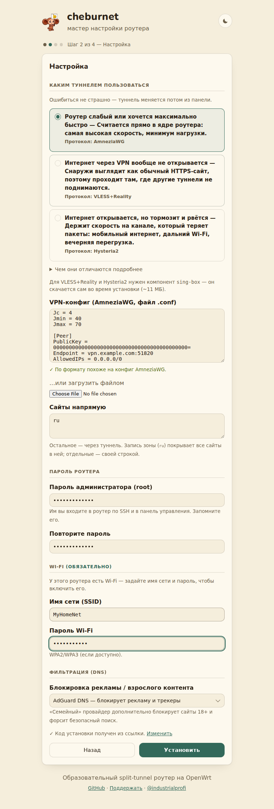
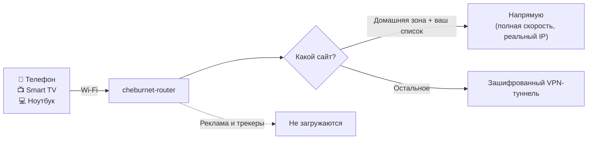

<div align="center">


# cheburnet-router

### Раздельное туннелирование и максимально ПРОСТАЯ установка из коробки: домашние сайты — напрямую, остальное — через VPN (AmneziaWG, VLESS+Reality, Hysteria2). Автоматически.

**Домашние сайты и сервисы — напрямую**, с полной скоростью и вашим настоящим IP. **Всё
остальное — через зашифрованный VPN.** Работает сразу на всех устройствах дома: телефоны,
ноутбуки, Smart TV — без приложений на каждом. Настраивается один раз через браузер, минут
за десять.

[](https://openwrt.org/)
[](https://github.com/andreiyurik/cheburnet-router/releases/latest)
[](https://github.com/andreiyurik/cheburnet-router/actions/workflows/test.yml)
[](LICENSE)
[](https://t.me/industrialprofi)

### [Установка](#установка) · [Что нужно и сколько стоит](#что-нужно-и-сколько-стоит) · [Три протокола](#три-протокола) · [Совместимое железо](#совместимое-железо) · [FAQ](#faq) · [Помощь](#нужна-помощь) · [Поддержать ♥](#поддержать-проект)

<sub><a href="README.en.md">English summary</a></sub>

<a href="assets/web-mgmt.png"></a>

<sub>Веб-панель <code>/cheburnet/</code> — статус сервисов, переключение протоколов и режимов, семейный фильтр, замена VPN-конфига одним кликом</sub>

</div>

---

## Что это даёт

Одно подключение к Wi-Fi — и на **всех** устройствах в доме сразу:

| Проблема | С cheburnet-router |
|---|---|
| Под VPN местные сайты тормозят, банки ловят капчи и блокируют вход. | Домашняя зона и ваш список сайтов — напрямую, с полной скоростью и вашим настоящим IP. |
| VPN-приложение надо ставить на каждое устройство. На Smart TV — вообще никак. | Настроили роутер один раз — покрыты все устройства в доме. |
| У одного VPN-протокола то соединение не устанавливается, то рвётся на плохом канале. | **Три протокола** на разные случаи, переключаются в панели. [Подробнее](#три-протокола). |
| VPN-прошивки требуют мощный роутер. | Работает в ядре Linux, без тяжёлых процессов — хватает роутера со 128 МБ RAM. |
| Провайдер видит ваши DNS-запросы, реклама лезет на каждом экране. | Шифрованный DNS и блокировка рекламы для всей сети сразу. Есть и [семейный фильтр](#семейный-режим). |
| VPN отвалился — трафик утёк в открытую сеть. | Kill-switch: по умолчанию трафик всегда идёт через VPN, утечки не будет. |

---

## Что нужно и сколько стоит

Чтобы всё заработало, нужны две вещи:

**1. Роутер с OpenWrt** — разово ~$35–60 за подходящую модель (см. [«Совместимое
железо»](#совместимое-железо)). Если OpenWrt-роутер уже есть — бесплатно.

**2. VPN-сервер** — свой VPS или подписка совместимого провайдера. Туннелю нужен сервер на другой
стороне, а бесплатных вариантов с приличной скоростью не бывает.

**Проект не привязан к провайдеру.** Подойдёт любой стандартный AmneziaWG-конфиг (`.conf`): свой
сервер на VPS (стек Amnezia открытый, документация публичная) или готовая подписка.

### Свой сервер: выберите протокол и поднимите за 10–15 минут

Нужен любой чистый VPS (Debian/Ubuntu, от ~$4–5/мес) — дальше по официальному гайду конкретного
протокола. Выбирайте по тому же принципу, что и в [«Три протокола»](#три-протокола): не знаете,
что нужно — берите AmneziaWG.

**Где взять VPS.** Подойдёт практически любой хостер — выбирайте сами по четырём критериям:

- **локация в другой стране** — сервер в вашей же стране не решит задачу туннеля;
- **KVM-виртуализация** (не OpenVZ/LXC) — иначе туннельные модули могут не завестись;
- **от 1 ГБ RAM** и любой минимальный диск — нагрузка от VPN крошечная;
- **удобная вам оплата** — и приятно, когда есть почасовые тарифы: можно попробовать за копейки.

| Протокол | Насколько просто | Официальный гайд |
|---|---|---|
| **AmneziaWG** (по умолчанию) | Без терминала: приложение AmneziaVPN само ставит сервер — вводите IP и пароль от SSH, остальное автоматически | [docs.amnezia.org →](https://docs.amnezia.org/documentation/instructions/install-vpn-on-server) |
| **VLESS+Reality** | Одна команда в терминале VPS ставит веб-панель **3x-ui**, дальше всё в браузере | [3x-ui на GitHub →](https://github.com/MHSanaei/3x-ui) |
| **Hysteria2** | Одна команда ставит сервер как сервис, но конфиг (пароль, сертификат) пишете сами по примеру из документации — без домена нужен свой сертификат | [Hysteria2 docs →](https://v2.hysteria.network/docs/getting-started/Server-Installation-Script/) |

> **VLESS+Reality: сервер молчит на любой попытке подключения?** Актуальная версия xray-core
> (≥26.7.11) в 3x-ui несовместима с нашим клиентом на роутере — известная проблема, чинится
> откатом xray-core на сервере до v26.6.27. Подробности и команды:
> [docs/kb/concepts/vless-reality.md](docs/kb/concepts/vless-reality.md#серверная-сторона).

Готовую ссылку или `.conf` из любого гайда вставляете в мастер cheburnet-router на шаге 4
[установки](#установка).

<div align="center">

### [Amnezia Premium — от 325 ₽/мес, скидка 15% по промокоду CHEBURNET15 →](https://storage.googleapis.com/amnezia/amnezia.org?m-path=premium&arf=EB5KDKXCJYQYP4MG&coupon=CHEBURNET15)

*Пример совместимого провайдера. Промокод `CHEBURNET15` уже встроен в ссылку: вам −15% к цене, проекту — поддержка.*

</div>

---

## Установка

Роутер с OpenWrt под рукой, VPN-конфиг (`.conf`) на руках — дальше это **пара команд по SSH и
мастер в браузере**, минут десять. Всё остальное роутер делает сам, а при сбое откатится к
исходному состоянию.

| Шаг | Что делаете | Время |
|---|---|---|
| 1 | Роутер с OpenWrt 25.12+ ([какой купить](#совместимое-железо), [как прошить](docs/00-flash-openwrt.md)) | ~30 мин, один раз |
| 2 | Взять VPN-подписку или поднять свой сервер — получить `.conf` ([подробнее](#что-нужно-и-сколько-стоит)) | ~5 мин |
| 3 | Подключиться к роутеру по SSH и запустить установщик | ~2 мин |
| 4 | Открыть ссылку из терминала, пройти мастер (`.conf`, пароль, Wi-Fi, «Установить») | ~5 мин |

### Шаг 3 — установщик по SSH

Перед командами проверьте две вещи:

- **у роутера есть интернет** — кабель провайдера воткнут в порт WAN (обычно выделен цветом).
  Установщик скачивает пакеты **на роутер**, поэтому интернет на компьютере не поможет;
- **компьютер подключён к этому роутеру** — к его Wi-Fi или LAN-кабелем.

Откройте терминал и подключитесь к роутеру:

```bash
ssh-keygen -R 192.168.1.1; ssh root@192.168.1.1
```

Приглашение сменится на `root@OpenWrt:~#` — теперь команды выполняются **на роутере**. Скачайте
и запустите установщик:

```sh
wget -O /tmp/cheburnet.sh https://raw.githubusercontent.com/andreiyurik/cheburnet-router/master/bootstrap/bootstrap.sh
sh /tmp/cheburnet.sh
```

<!-- Почему две команды, а не `wget -qO- … | sh`: raw.githubusercontent.com в реальных сетях
     флапает (замерено: до 1/3 запросов — 0 байт), а `sh` на пустом вводе молча выходит с кодом 0
     — для человека это «ничего не произошло». Здесь wget без -q, поэтому пустой/неудавшийся
     ответ виден сразу и повторяется руками.
     ssh-keygen -R перед ssh — заранее стирает старый ключ 192.168.1.1 из known_hosts: тот же IP
     раньше мог принадлежать другому роутеру (или этому же до сброса к заводским), и без этого
     шага SSH считает смену ключа возможной MITM-атакой и рвёт подключение
     (WARNING: REMOTE HOST IDENTIFICATION HAS CHANGED). Если записи ещё нет — команда просто
     печатает «not found» и ничего не делает, это нормально.
     Однострочный устойчивый вариант (5 попыток, для нестабильной сети) — docs/open-terminal.md;
     там же причина, почему внутри ssh-однострочника нельзя использовать двойные кавычки и
     скобки: PowerShell 5.1 их не экранирует (баг native-arg-passing, починен в 7.3+), и шелл
     роутера получает `Syntax error: "(" unexpected`. -->

> **Где взять терминал:** **Windows** — правый клик по «Пуск» → **Терминал** / **PowerShell**.
> **macOS** — Spotlight (⌘+Space) → `Terminal`. **Linux** — `Ctrl+Alt+T`.
> **Пароль `root@…`** на свежем OpenWrt пустой — просто нажмите **Enter** (свой зададите в мастере).
> **`ssh` не подключается (`timed out`)?** Адрес роутера может быть не `192.168.1.1` —
> посмотрите его на наклейке снизу роутера или в свойствах сети компьютера (поле
> «шлюз»/«gateway») и подставьте в обе команды вместо `192.168.1.1`.
>
> **Первый раз в терминале?** Пошагово: [как открыть терминал и вставить
> команду](docs/open-terminal.md). **Не хотите трогать терминал вообще?** Если на роутере есть
> LuCI — [установка через браузер](docs/install-no-ssh.md).

> **Не ставится? `apk update` не проходит?** В некоторых сетях зеркало OpenWrt недоступно — дайте
> роутеру интернет через сторонний VPN на 10 минут, инструкция:
> **[docs/install-blocked.md](docs/install-blocked.md)**. После установки роутер сам уйдёт под
> VPN, и проблема больше не вернётся.

### Шаг 4 — веб-мастер

Установщик около минуты ставит пакеты, потом печатает ссылку с одноразовым токеном:

<div align="center">
<a href="assets/install-terminal.png"></a>
<sub>Скопируйте ссылку <code>http://192.168.1.1/cheburnet/?token=…</code> и откройте в браузере.<br>
Токен одноразовый: он доказывает, что мастер запустили именно вы, и удаляется после установки</sub>
</div>

> **Закрыли терминал или потеряли ссылку?** Повторите обе команды шага 3 — установщик напечатает
> **ту же самую** ссылку. Повторный запуск безопасен: уже установленное он не трогает.

Дальше — несколько экранов: загрузка `.conf`, пароль администратора, имя и пароль Wi-Fi, кнопка
«Установить». Роутер всё сделает сам, прогресс виден в браузере.

<div align="center">

<sub>Веб-мастер — загрузка <code>.conf</code> VPN-сервера</sub>
</div>

После установки на том же адресе открывается **панель управления**: статус, смена VPN-конфига
и протокола, семейный фильтр, диагностика и сброс — всё в браузере, без SSH.

> «Сбросить настройку» снимает **конфигурацию** (туннель, разделение трафика, DoH, фильтрацию),
> но оставляет саму программу и панель — настроить заново можно сразу оттуда же. Wi-Fi и пароль
> роутера не трогаются. Подробно, что снимается, а что остаётся —
> [Troubleshooting](docs/kb/reference/troubleshooting.md#сброс-настройки-что-снимается-а-что-остаётся).
> Удалить целиком (пакет и зависимости) — [docs/uninstall.md](docs/uninstall.md).

---

## Как это работает



Список сайтов, которые идут напрямую, — **ваш**: мастер лишь предлагает дефолт, а правится он
одним полем в панели, без переустановки и перезагрузки. Домен (`example.com`) покрывает и все его
поддомены.
По умолчанию — туннель: сайт не попал в список, значит уйдёт через VPN, а не в открытую сеть.

---

## Три протокола

**AmneziaWG** — быстрее и легче остальных, подходит почти всем и работает даже на слабом
роутере, поэтому мастер предлагает его на слабом/среднем железе. На мощном роутере мастер
по умолчанию предложит **VLESS+Reality** — он закрывает самую частую жалобу («VPN вообще не
подключается»), которую AmneziaWG сам решить не может. Ошибиться не страшно: переключение —
в веб-панели, без переустановки, тот же список сайтов напрямую, тот же kill-switch, меняется
только сам туннель.

| Протокол | Когда выручает |
|---|---|
| **AmneziaWG** (дефолт на слабом/среднем железе) | Обычная ситуация — максимум скорости при минимуме нагрузки на роутер |
| **VLESS+Reality** | VPN-соединение **вообще не устанавливается** — маскирует туннель под обычный HTTPS к настоящему сайту |
| **Hysteria2** | Соединение есть, но **тормозит и рвётся** — плохой Wi-Fi, мобильный интернет, перегруженный канал |

Два дополнительных протокола требуют более мощного роутера: мастер сам проверит железо и
предложит их, если потянет. Не потянет — работает AmneziaWG, настраивать ничего не нужно.
Подробнее: [VLESS+Reality](docs/kb/concepts/vless-reality.md), [Hysteria2](docs/kb/concepts/hysteria2.md).

---

## Семейный режим

Выберите **семейный DNS-фильтр** в панели (например, AdGuard Family) — и на всех устройствах
в Wi-Fi включится блокировка нежелательного контента и принудительный SafeSearch, даже если
в самом сервисе он выключен. Вернуть обычный фильтр можно в любой момент тем же списком.

<details>
<summary>Чего семейный режим НЕ делает</summary>

<br>

- Это **DNS-фильтр**, а не родительский контроль внутри сервисов. Ленты TikTok / Instagram / чаты фильтру не видны — контент идёт по HTTPS внутри одного домена; для них нужны встроенные возрастные ограничения.
- Не действует на устройство, где включён **свой VPN или свой DoH** в браузере — оно ходит мимо роутера.
- Покрытие — крупные NSFW-домены и зеркала; нишевые могут не попадать. Список обновляется автоматически.

</details>

---

## Совместимое железо

**Подойдёт любой роутер на OpenWrt 25.12+** (минимум 128 МБ RAM и 16 МБ свободного флеша;
комфортно — от 256 МБ RAM). Архитектуру пакет определяет сам — установка работает на aarch64,
x86_64, mipsel и других платформах без правок, а перед изменениями роутер проверит своё железо.

**Если OpenWrt-роутер уже есть**, проверьте три пункта:
- Поддержка OpenWrt 25.12+ — [openwrt.org/toh](https://openwrt.org/toh/start) (фильтр по версии).
- RAM ≥ 128 МБ, свободного flash ≥ 16 МБ (лучше с запасом: 256+ МБ RAM, 32+ МБ flash).
- Архитектура есть в [awg-openwrt releases](https://github.com/Slava-Shchipunov/awg-openwrt/releases) — без `kmod-amneziawg` VPN не поднимется.

**Если покупаете с нуля** — рекомендую серию **Cudy** на чипсете MT7981B: производитель лоялен к
OpenWrt (официальные сборки на [openwrt.org/toh/cudy](https://openwrt.org/toh/cudy/)), прошивается
стоковым web-интерфейсом, 512 МБ RAM, цена ~$40–60.

| Сценарий | Модель | Цена | Особенности |
|---|---|---|---|
| **В поездку** | Cudy TR3000 | ~$40–55 | Компактный, питание USB-C 5V, 2.5 GbE WAN |
| **Дома** | Cudy WR3000P | ~$50–65 | 4×GbE LAN + 2.5 GbE WAN |
| **С запасом** | Cudy AP3000 | ~$60–75 | 256 МБ flash под эксперименты |

> Роутеры с 16 МБ флеша целиком (свободно ~5–10 МБ) эту проверку **не пройдут** — не хватает
> места под зависимости; вариант — вынести систему на USB (extroot). Мастер покажет, чего именно
> не хватает, и даст установить на свой страх и риск.
> Полный список моделей — [openwrt.org/toh/views/toh_available_25](https://openwrt.org/toh/views/toh_available_25), поиск прошивки — [firmware-selector.openwrt.org](https://firmware-selector.openwrt.org).

---

## FAQ

<details>
<summary><b>Это легально?</b></summary>

<br>

Да — это стандартные сетевые технологии, их используют корпорации и банки. Подробности и границы ответственности — в разделе [«Дисклеймер»](#ограничения-и-дисклеймер) ниже.

</details>

<details>
<summary><b>Скорость интернета упадёт?</b></summary>

<br>

На домашнюю зону и ваш список — нет, они идут напрямую. На остальное — зависит от VPN-сервера и канала, но обычно роутер держит 200–500 Мбит/с в туннеле. Для видео, мессенджеров и веба разницы не заметите.

</details>

<details>
<summary><b>Что если VPN-сервер недоступен?</b></summary>

<br>

Включается kill-switch — трафик не утечёт в открытую сеть. Домашняя зона и сайты вашего списка продолжают работать напрямую. В панели видно, что VPN упал: можно одним кликом перезапустить туннель, сменить `.conf` или переключиться на другой протокол. Если сервер умер надолго, а интернет нужен сейчас — кнопка **«Выключить защиту»** пускает всё напрямую (без VPN и kill-switch), вторая кнопка возвращает защиту; настройка при этом не теряется.

Сам роутер за собой тоже следит: раз в пять минут сторож сверяет маршруты, kill-switch и DNS с тем, что должно быть, и чинит починимое (подъём WAN, маршрут туннеля, резервный DNS). В журнал он пишет только про поломки — пустой журнал сторожа означает «всё на месте».

</details>

<details>
<summary><b>Как сменить VPN-протокол?</b></summary>

<br>

В панели разверните блок «Туннель» → «Сменить туннель»: радиокнопки там подписаны по симптому («роутер слабый», «VPN вообще не открывается», «тормозит и рвётся»), не по названию протокола — можно выбирать не зная технических деталей. **Важно:** для каждого протокола нужна отдельная ссылка/`.conf` от VPN-сервера — это не выбор из готового списка, и не каждый провайдер выдаёт все три сразу (уточните у своего или поднимите свой сервер — см. [«Что нужно и сколько стоит»](#что-нужно-и-сколько-стоит)). Для VLESS+Reality и Hysteria2 на подходящем железе панель один раз докачивает компонент (~11 МБ) — отдельный шаг перед тем, как появится возможность переключиться. Не поднялся новый туннель — прежний вернётся сам, трафик не потеряется.

</details>

<details>
<summary><b>Чем это отличается от NordVPN / Proton / коммерческого VPN?</b></summary>

<br>

Не «лучше», а **по-другому**. Коммерческий VPN — закрытое приложение на каждом устройстве, всё
доверяете одной компании. Здесь — открытый код на вашем роутере, покрывает разом все устройства
в доме, включая Smart TV, и умеет раздельное туннелирование — это коммерческие сервисы почти
никогда не предлагают.

Минус: нужен свой VPN-сервер — подписка провайдера либо свой VPS.

</details>

<details>
<summary><b>А если я переезжаю или меняю провайдера?</b></summary>

<br>

Роутер можно брать с собой — подключили к новому интернету, всё работает как раньше.

**Не хотите менять основной роутер дома?** Подключите cheburnet-router WAN-портом к старому роутеру — получите **вторую Wi-Fi-сеть** рядом со старой. Устройства в новой сети идут через VPN и блок рекламы; остальные работают через старый роутер как обычно.

</details>

---

## Нужна помощь

Я веду проект сам и отвечаю всем. Застряли на любом шаге, что-то не работает после установки или
просто есть вопрос — **пишите, это лучшее, чем можно помочь проекту**: каждое сообщение о проблеме
превращается в правку кода.

### [Создать issue на GitHub](https://github.com/andreiyurik/cheburnet-router/issues/new/choose) ← лучший способ

**Issue лучше лички:** ответ останется на виду и поможет следующему с той же проблемой. Аккаунт
GitHub бесплатный, регистрация — минута.

### [Написать в Telegram: @industrialprofi](https://t.me/industrialprofi)

Если issue заводить неудобно или вопрос личный — пишите в Telegram, отвечу так же.

**Приложите диагностику — разберёмся быстрее.** Кнопка **«Собрать диагностику»** в панели
соберёт логи и версии в один файл. **Пароли и ключи вырезаются автоматически**, а сам текст
можно посмотреть перед отправкой — роутер ничего не отправляет сам. Подробности —
[Troubleshooting](docs/kb/reference/troubleshooting.md).

---

## Поддержать проект

Я делаю всё один — код, документацию, ответы в Telegram, разбор багов у конкретных людей. Это часы
после основной работы, и именно поддержка определяет, сколько таких часов я могу находить.
Каждый донат и каждая звезда конвертируются напрямую: в новые возможности, больше тестов на
реальном железе и более быстрые ответы на вопросы. Проект бесплатный и таким останется. Если он
вам помог — **поблагодарить автора можно донатом**.

<div align="center">

<a href="https://pay.cloudtips.ru/p/61fe8ef3"></a>

**[CloudTips — карта / СБП](https://pay.cloudtips.ru/p/61fe8ef3)** · TON: `UQC2KsPX-Ad9P8x_VbN3GHbpacOMvYPIbZvLppb-sxJ88KfV` · Bitcoin: `bc1qen3tutepyqjtsn7meggcertp6x4m0492vkg4m2`

Без денег тоже можно помочь: звезда на GitHub, репорт бага, рассказать другу. Подробнее — [support.md](docs/support.md).

</div>

[Ещё нет VPN-сервера? Amnezia Premium со скидкой 15% по промокоду CHEBURNET15 →](https://storage.googleapis.com/amnezia/amnezia.org?m-path=premium&arf=EB5KDKXCJYQYP4MG&coupon=CHEBURNET15)

*Партнёрская ссылка: вам −15% к цене, проекту — поддержка. Это не влияет на код — подойдёт конфиг любого провайдера.*

---

<details>
<summary><h2>Под капотом</h2></summary>

<br>

> Для контрибьюторов и любопытных. Проект открытый — весь код можно прочитать, а каждый шаг маршрутизации построен на стандартных примитивах ядра, а не на «магии».

**Data-plane собран из примитивов ядра Linux** (лёгкий, едет на слабом железе, каждый шаг виден):

| Технология | Роль |
|---|---|
| **AmneziaWG** (Light-тир, по умолчанию) | VPN-туннель с обфускацией — маскирует сетевую сигнатуру, сохраняя скорость WireGuard |
| **sing-box-tiny: VLESS+Reality, Hysteria2** (Full-тир, опционально) | Два протокола под разные симптомы — см. [«Три протокола»](#три-протокола); догружается автоматически при выборе |
| **dnsmasq-nftset + nftables** | Split-routing: dnsmasq складывает IP direct-доменов в nftset, nftables метит пакеты |
| **policy routing (ip rule)** | Помеченный трафик — в туннель, direct-список — напрямую через WAN |
| **https-dns-proxy** | Шифрованный DNS (DoH) — провайдер не видит сами домены |
| **Фильтрующий DoH-резолвер** | Блокировка рекламы/трекеров и семейный фильтр — выбором DNS-провайдера (AdGuard, AdGuard Family, CleanBrowsing, …) |
| **Движок на ucode** | Установка, генерация конфигов, preflight, идемпотентные шаги, точечный rollback |
| **Веб-мастер на Svelte** | Общается с роутером через ubus RPC |

**Надёжность — три простых кирпича:** строгий **preflight** (честно откажет на негодном железе),
**идемпотентные шаги** (повторный запуск чинит, а не ломает), **точечный rollback** там, где откат
чистый.

**Документация и архитектура** — в [`docs/`](docs/) (принципы и разбор каждого механизма от первых
принципов), целевая архитектура — [docs/architecture.md](docs/architecture.md). Как поучаствовать —
[CONTRIBUTING.md](CONTRIBUTING.md).

**Управление** — через веб-панель `/cheburnet/` (статус, режимы HOME/TRAVEL, перезапуск сервисов,
семейный режим, замена `.conf`, аварийный режим, сброс настройки) или по SSH через `ubus`/`uci` для продвинутых.

</details>

---

## Ограничения и дисклеймер

- **cheburnet — не антивирус.** Защищает сеть, не лечит malware на устройствах.
- **Без VPN-сервера работают только локальные функции:** фильтр рекламы и прямой доступ к сайтам вашего списка.
- **Не блокирует 100% рекламы** — например, реклама в YouTube идёт с тех же серверов, что и видео.

Открытый образовательный проект: демонстрация современного open-source-стека для роутеров и рабочий
стенд для сетевых технологий — AmneziaWG/WireGuard, DoH, split-routing, nftables. Эти технологии
стандартные и применяются в корпоративных сетях, банкинге и при работе в публичных Wi-Fi.

Содержимое direct-списка и назначение туннеля — настройки пользователя. Применять эти технологии
законно в большинстве стран, но ответственность за соблюдение местного законодательства — на
пользователе. Проект не предназначен для нарушения законов вашей юрисдикции.

---

## Благодарности

**Open-source проекты:** [AmneziaVPN](https://amnezia.org/) · [SagerNet/sing-box](https://github.com/SagerNet/sing-box) · [Slava-Shchipunov/awg-openwrt](https://github.com/Slava-Shchipunov/awg-openwrt) · [https-dns-proxy](https://github.com/aarond10/https_dns_proxy) · [OpenWrt](https://openwrt.org/)

**Люди:** проект живёт благодаря тем, кто тестирует, находит баги и пишет с обратной связью — спасибо
каждому. Особая благодарность **Сергею Ш.** за активное участие и ценные идеи.

---

[MIT License](LICENSE) — форкайте, адаптируйте, шлите PR.
