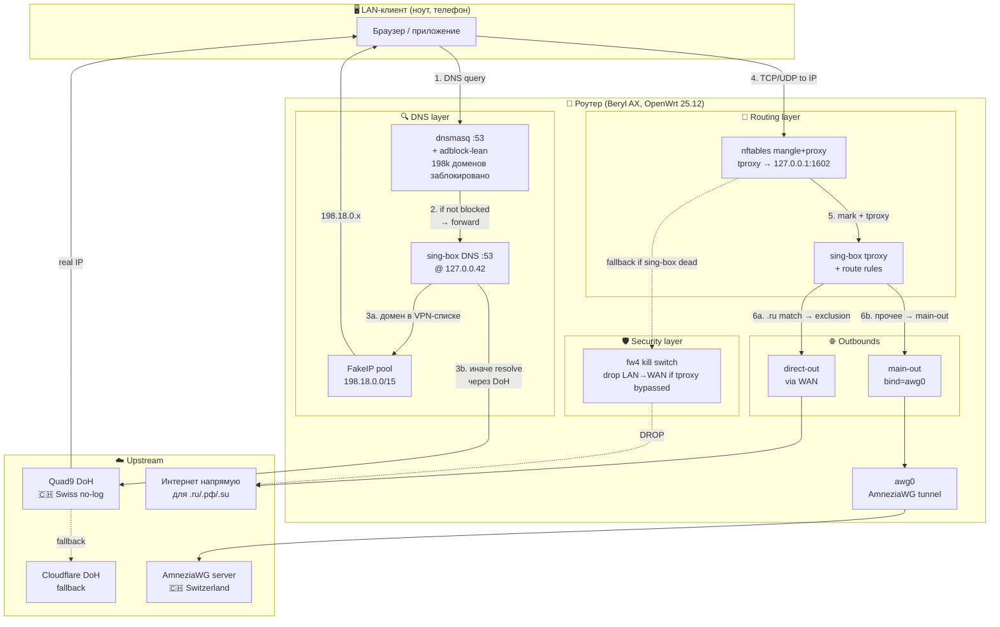
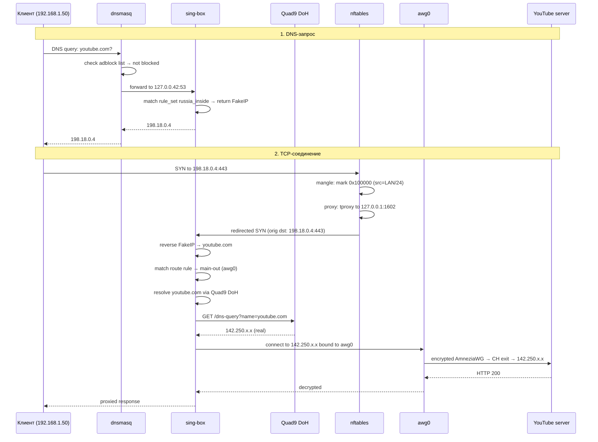

# 📐 01. Архитектура системы

## TL;DR

LAN-клиент делает DNS-запрос → dnsmasq применяет adblock-фильтр → форвардит в sing-box → sing-box либо выдаёт **FakeIP 198.18.x.x** (для доменов, которые пойдут через VPN), либо реальный IP через зашифрованный DoH к Quad9 (для прямого роутинга). Клиент подключается к полученному IP → nftables ловит трафик → tproxy-редиректит в sing-box → sing-box отправляет либо в AWG-туннель до Швейцарии, либо напрямую через WAN (для `.ru`-доменов и известных RU-сервисов). Физический слайдер на корпусе переключает между **HOME** (с исключениями для RU) и **TRAVEL** (full tunnel, всё через VPN).

## Большая схема

## Слои системы

Архитектура строится на принципе **defense-in-depth** — каждый слой выполняет свою роль, и отказ одного не означает полный выход из строя.

### 1. DNS-слой (перехват + фильтрация)

**Задачи:**
- Блокировать рекламу/трекеры на уровне резолвинга (adblock-lean)
- Шифровать все DNS-запросы наружу (DoH к Quad9)
- Возвращать **FakeIP** для доменов, которые пойдут через VPN (это триггер для tproxy)

**Ключевые компоненты:**
- `dnsmasq` слушает `192.168.1.1:53` (классический путь для LAN-клиентов)
- Форвардит всё в `127.0.0.42:53` (это sing-box)
- `noresolv=1` — не использует системный резолвер
- adblock-lean добавляет `local=/blocked-domain/` → dnsmasq отвечает NXDOMAIN

### 2. Роутинг-слой (кто куда идёт)

**Задачи:**
- Перехватывать весь LAN-трафик в sing-box через TPROXY
- Отделять «в туннель» от «напрямую»
- Применять исключения (`.ru`, `vk.com`, список `russia_outside`)

**Ключевые компоненты:**
- `nftables` `PodkopTable` — mangle-chain маркирует пакеты, proxy-chain делает tproxy-редирект
- `sing-box tproxy-in :1602` — получает пакеты, смотрит SNI/домен, сопоставляет с правилами
- Два outbound'а: `main-out` (bind=awg0) и `direct-out` (через WAN)

### 3. Транспортный слой (VPN)

**Задачи:**
- Скрыть трафик от DPI провайдера (обфускация)
- Зашифровать до exit-узла в CH
- Перехватить полное внешнее IP-назначение (AllowedIPs=0.0.0.0/0, ::/0)

**Ключевой компонент:** `awg0` — AmneziaWG-интерфейс в proto `amneziawg`.

### 4. Security-слой (kill switch)

**Задачи:**
- Подстраховать от утечки при сбое sing-box или podkop
- Закрыть forward-путь LAN→WAN для пакетов с LAN-source

**Ключевой компонент:** fw4-правило `KillSwitch-*` в forward-chain.

### 5. Управление (слайдер + LED)

**Задачи:**
- Дать пользователю **физический** контроль без необходимости заходить в веб-интерфейс
- Показать состояние системы визуально

**Компоненты:**
- `gpio_button_hotplug` → `/etc/hotplug.d/button/10-vpn-mode`
- CLI `vpn-mode`
- `/etc/init.d/vpn-mode` — синхронизация при загрузке

## Поток трафика: детальный пример

Разберём конкретный сценарий — **пользователь открывает youtube.com**:

## Почему так, а не иначе

Разбор ключевых архитектурных решений, с отвергнутыми альтернативами.

### Почему не чистый WireGuard?

✅ **WireGuard — отличная база**: компактный, безопасный, быстрый, в ядре Linux.
❌ **Но DPI в РФ** распознаёт его по фингерпринту handshake-пакета (первые 4 байта стабильны: `0x01 0x00 0x00 0x00`). AmneziaWG добавляет **junk-пакеты** (Jc/Jmin/Jmax), **случайное padding** (S1/S2) и **заголовки-обманки** (H1-H4), чтобы handshake выглядел как случайный UDP-шум. Подробно: [docs/02](02-amneziawg.md).

### Почему не OpenVPN/V2Ray/Shadowsocks?

- **OpenVPN** — стабильный ветеран, но медленный и тоже детектируется DPI (характерные TLS-отпечатки).
- **V2Ray/Xray с Reality** — тоже хороши, но сложнее в настройке, больше движущихся частей.
- **Shadowsocks** — прокси, а не VPN; через sing-box тоже поддерживается, но для наших целей AWG проще (один `awg0` интерфейс, netifd управляет).

### Почему podkop, а не passwall/v2raya/openclash?

- **Passwall** — хорош, но заточен под ImmortalWrt/LEDE, не всегда работает на ванильном OpenWrt.
- **v2raya** — Web UI-ориентирован, мало настроек через UCI.
- **OpenClash** — мощный, но требует больше ресурсов и `clash premium` (проприетарный).
- **Podkop** — активно развивается, заточен под сценарий РФ, отличная UCI-интеграция, прост в скриптовании.

### Почему FakeIP, а не чистый subnet-routing?

**Альтернатива:** скачиваем список IP-диапазонов заблокированных сервисов, роутим их в VPN, остальное — прямо. Проблемы:
- Cloudflare, Google, Akamai ротируют IP **внутри своих /16** много раз в час. Список протухает.
- Shared hosting: один IP может обслуживать и «хороший» сайт, и «плохой».
- Списки IP огромные (миллионы entries), память/CPU.

**FakeIP решает это domain-first:** мы матчим по **имени домена**, а не по IP. Клиент получает «служебный» IP из 198.18.0.0/15 (RFC 6815 — зарезервирован для benchmark-тестов, никогда не встречается в реальной сети) как триггер «этот трафик — в туннель».

### Почему kill switch через nftables, а не через интерфейсы?

**Альтернатива:** использовать NetworkManager-style «kill switch» — когда VPN падает, автоматически отключать WAN-интерфейс. Проблемы:
- Сам роутер перестаёт резолвить DNS, обновлять списки, время, пересоздавать туннель — deadlock.
- LAN-клиенты потеряют DHCP-обновления, DNS-резолвинг локальных имён.

**fw4-правило** точечно: блокирует **forward LAN→WAN**, но **input** (админка роутера) и **output** (служебный трафик с роутера) работают. Локальная сеть функциональна, только «наружу» без VPN никому не выйти.

## Threat model

Короткий чек-лист «от кого защищает, от кого нет»:

| Атакующий | Защита |
|---|---|
| **Провайдер в РФ** (СОРМ, DPI) | ✅ Весь трафик шифрован. DNS через DoH. AmneziaWG-обфускация. |
| **Роскомнадзор** (блокировка сайтов) | ✅ FakeIP + VPN-маршрутизация обходит блокировки. |
| **Пассивный наблюдатель сети** (сосед с Wi-Fi-сниффером) | ✅ WPA3-SAE + PMF. |
| **Активный атакующий в Wi-Fi** (подмена AP, deauth) | ✅ PMF, SAE защищены от downgrade. |
| **Утечка при сбое VPN** | ✅ 3-слойная защита: tproxy drop + fw4 kill switch + sing-box bind fail. |
| **Утечка DNS-метаданных** | ⚠️ Частично: DoH скрывает домены от ISP. Но Quad9 видит RU-source-IP. |
| **Физический доступ к роутеру** (злоумышленник с 5 минут) | ❌ Recovery mode, factory reset. Ничего не сделать. |
| **Скомпрометированный клиент** (троян на ноуте) | ❌ Роутер не спасает от троянов. |

## Проверь себя

1. **Что произойдёт, если сломается sing-box, но podkop продолжит работать (нет, но представим)?**
   

Ответ
Nft-правила podkop'а остаются. Пакет маркируется, tproxy-редиректится на 127.0.0.1:1602, но там **никто не слушает**. Kernel TPROXY дропает пакет. Утечки нет.

2. **Почему DNS-сервер по умолчанию Quad9, а bootstrap — Cloudflare?**
   

Ответ
Quad9 — Swiss non-profit с no-log политикой и malware-блокировкой, лучший privacy-профиль. Cloudflare нужен только ОДИН раз при старте sing-box, чтобы разрезолвить `dns.quad9.net` → IP; после этого DoH-трафик напрямую к 9.9.9.9. Разделение ролей: bootstrap должен быть просто быстрым и надёжным.

3. **Что увидит провайдер, если засниффит трафик между роутером и VPN-сервером?**
   

Ответ
Зашифрованный UDP-поток к IP швейцарского сервера. На handshake-пакетах — случайный junk + фейковые заголовки (AWG-обфускация), не похоже ни на WG, ни на что-либо сигнатурное. Только факт существования соединения.

## 📚 Глубже изучить

- [Cloudflare Learning: What is a VPN?](https://www.cloudflare.com/learning/access-management/what-is-a-vpn/) — базовый ликбез
- [WireGuard Whitepaper (Donenfeld, 2017)](https://www.wireguard.com/papers/wireguard.pdf) — первоисточник про WG, 12 страниц
- [AmneziaWG / ТЗ и Changelog](https://docs.amnezia.org/documentation/amnezia-wg/) — официальная доку
- [sing-box docs](https://sing-box.sagernet.org/) — универсальный комбайн, у нас используется через podkop
- [Defense in Depth (NIST)](https://csrc.nist.gov/glossary/term/defense_in_depth) — концепция многослойной защиты
- 📺 [Ben Eater: Networking (YouTube)](https://www.youtube.com/watch?v=HnnEbHuAmhs) — если хочется понять как вообще работают пакеты на уровне железа
