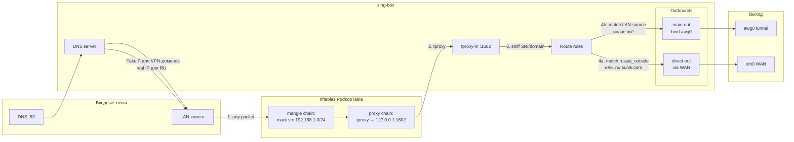

# 🧭 03. Podkop и маршрутизация

## TL;DR

**Podkop** — скрипт-обёртка над **sing-box**, который генерирует конфиг sing-box из UCI-настроек и управляет nftables-правилами tproxy. В нашей конфигурации **две секции**: `main` (connection_type=vpn) с `fully_routed_ips='192.168.1.0/24'` — это говорит «весь LAN через AWG», и `exclude_ru` (connection_type=exclusion) с `community_lists='russia_outside'` + `user_domains='.ru .su .xn--p1ai vk.com'` — «эти домены напрямую через WAN». Слайдер на корпусе переключает между **HOME** (обе секции активны) и **TRAVEL** (секция exclude_ru «обнуляется», только main).

## Что такое Podkop

[Podkop](https://github.com/itdoginfo/podkop) — это shell-скрипт + LuCI-приложение + init-сервис + nftables-конфигуратор, который объединяет:

1. **Перехват трафика** (tproxy через nftables)
2. **Маршрутизацию** (через sing-box)
3. **Управление списками** (community lists как `russia_inside`, `russia_outside`)

Он не изобретает велосипед — sing-box умеет всё нужное сам. Podkop даёт UCI-обёртку и подписки на готовые списки. Для подхода «я хочу настроить роутер в РФ для обхода цензуры за 15 минут» — незаменимый инструмент.

## Sing-box под капотом

[sing-box](https://sing-box.sagernet.org/) — универсальный proxy-router на Go, идеологически восходящий к V2Ray/Xray. Умеет:

- **Inbounds**: TPROXY, HTTP, SOCKS, mixed, tun
- **Outbounds**: direct, shadowsocks, vmess, vless, trojan, wireguard, tor, selector, urltest, …
- **DNS**: UDP, DoT, DoH, DoQ, FakeIP, rule-set-based matching
- **Route rules**: по домену, IP, rule-set, source-IP, inbound tag

В нашей конфигурации sing-box получает на вход:
- **tproxy-in** — пакеты с LAN (после marking в nftables)
- **dns-in** — DNS-запросы от dnsmasq (на 127.0.0.42:53)

…и отдаёт на выход:
- **main-out** — `type=direct, bind_interface=awg0` (туннельный путь)
- **direct-out** — `type=direct` (WAN-путь)
- **bootstrap-dns-server** — UDP к 1.1.1.1 (только для разрезолва DoH-хоста при старте)

## Архитектура маршрутизации



## Два режима: HOME и TRAVEL

Физический слайдер на корпусе Beryl AX (3-пин переключатель, GPIO-512) переводит систему между двумя состояниями.

### HOME (слайдер влево)

- **Цель:** всё иностранное через VPN, RU-сервисы напрямую с реального IP.
- **Когда пригодится:** повседневно, дома в РФ.
- **Секция `main`:** активна, `fully_routed_ips='192.168.1.0/24'` — весь LAN через AWG.
- **Секция `exclude_ru`:** активна, `community_lists='russia_outside'` + `user_domains='.ru .su .xn--p1ai vk.com'` — эти домены **вытаскиваются** обратно в direct-out.

**Правила в sing-box (упрощённо):**
```
1. sniff (tproxy-in, dns-in)           -- определить SNI/host
2. hijack-dns (protocol=dns)
3. domain matches russia_outside list OR .ru/.su/.xn--p1ai/vk.com
   → outbound=direct-out  (НЕ в туннель)
4. source_ip_cidr=192.168.1.0/24
   → outbound=main-out    (в туннель)
5. final=direct-out                    -- router-originated трафик не тунелируется
```

Порядок важен: правило `3` срабатывает **раньше** правила `4`. Если домен в списке — идём direct-out. Иначе — main-out.

### TRAVEL (слайдер вправо)

- **Цель:** **абсолютно весь** LAN-трафик через VPN, без исключений.
- **Когда пригодится:** поездка в «недоверенную» сеть (hotel Wi-Fi, аэропорт), максимальная паранойя.
- **Секция `main`:** активна (как в HOME).
- **Секция `exclude_ru`:** **обнулена** — UCI-опции `community_lists` и `user_domains` **удалены**.

Podkop видит: «секция `exclude_ru` не имеет ни одной непустой списочной опции» → пропускает её. Exclusion-правило в sing-box **не создаётся**.

**Правила в sing-box (упрощённо):**
```
1. sniff
2. hijack-dns
3. source_ip_cidr=192.168.1.0/24 → main-out
4. final=direct-out
```

Всё LAN → в туннель. Никаких исключений.

### Как переключается

Скрипт `/usr/bin/vpn-mode` меняет UCI-опции секции `exclude_ru` и перезапускает podkop. Вызывается:
- **Автоматически**: `/etc/init.d/vpn-mode` при загрузке
- **Вручную**: `vpn-mode home | travel | toggle | status`

Подробно об управлении режимами → [docs/07-modes.md](07-modes.md).

## FakeIP: ключевой приём

### Зачем оно

Sing-box умеет маршрутизировать **по домену** (domain_suffix, domain_keyword, rule_set). Но в момент, когда LAN-клиент устанавливает TCP-соединение, он шлёт пакет **на IP**, не на домен. К моменту перехвата пакета nftables уже ничего не знает про имя хоста.

Решение — **FakeIP**. Когда клиент делает DNS-запрос на «заблокированный» домен, sing-box возвращает ему не реальный IP, а **служебный** из диапазона `198.18.0.0/15`. Клиент открывает соединение на этот fake-IP. Sing-box получает пакет через tproxy, смотрит: «ага, это мой фейк — изначально клиент спрашивал youtube.com» → подставляет route-правило для youtube.com.

> **💡 Почему именно 198.18.0.0/15.** Этот диапазон зарезервирован [RFC 6815](https://datatracker.ietf.org/doc/html/rfc6815) для benchmark-тестов сетевого железа. В реальном интернете никогда не встречается. Идеальный кандидат под «свой» внутренний идентификатор.

### Как это работает в нашем сетапе

1. LAN-клиент: `nslookup youtube.com 192.168.1.1`
2. `dnsmasq` проверяет adblock → не заблокировано → форвардит `127.0.0.42:53`
3. `sing-box DNS server` смотрит правила:
   ```
   {
     "action": "route",
     "server": "fakeip-server",
     "rule_set": "main-russia_inside-community-ruleset"
   }
   ```
   Домен `youtube.com` — в rule_set `russia_inside` (куратор списка: [itdoginfo/allow-domains](https://github.com/itdoginfo/allow-domains)). Возвращается FakeIP, скажем `198.18.0.4`.
4. Клиент делает TCP-connect на `198.18.0.4:443`.
5. Пакет попадает в роутер → `nftables` маркирует (dst в диапазоне `198.18.0.0/15`) → tproxy → sing-box.
6. Sing-box через внутренний FakeIP-cache вспоминает: «198.18.0.4 = youtube.com». Применяет route-правило → main-out (через awg0).
7. main-out открывает соединение к youtube.com (разрезолвив **реальный** IP через Quad9), отправляет через awg0.

Почти волшебно.

## Правильный маппинг списков

Здесь была наша ошибка в процессе сборки. Запомните:

| Название | Что внутри | Когда использовать |
|---|---|---|
| `russia_inside` | Домены, **заблокированные в РФ** (YouTube, Meta, Twitter, Discord, Tiktok, hdrezka...) | Если цель: «VPN только для заблокированного, остальное direct» → use as `main.community_lists` |
| `russia_outside` | `.ru`-сервисы, которые **geo-блокируют не-РФ** (Госуслуги, Sberbank, Ozon, RZD...) | Если цель: «всё через VPN кроме RU» → use as `exclude_ru.community_lists` |

**Трюк запомнить:** «inside/outside» относится к **тому, кто блокирует**. `russia_inside` — заблокировано **в РФ**. `russia_outside` — заблокировано **для не-РФ**.

Наш сценарий: роутер **в РФ**, хотим «всё через VPN, кроме RU» → используем `russia_outside` в exclusion-секции + TLD-саффиксы.

### Что именно в `russia_outside`

На момент написания (апрель 2026) — **37 доменов**, курируемый список:
```
gosuslugi.ru, mos.ru, nalog.ru, pochta.ru, rzd.ru, ozon.ru,
avtodor-tr.ru, emex.ru, fssp.gov.ru, gov.ru, leroymerlin.ru, ...
```

Список **НЕ содержит** `.ru` TLD целиком. Поэтому мы **дополняем** его вручную через `user_domains`:
- `.ru` — любой домен в `.ru` TLD
- `.su` — на всякий случай, legacy
- `.xn--p1ai` — punycode для `.рф`
- `vk.com` — один из крупнейших RU-сервисов на **.com** TLD

## UCI-конфигурация podkop

```ini
# /etc/config/podkop
config settings 'settings'
    option dns_type 'doh'
    option dns_server 'dns.quad9.net/dns-query'
    option bootstrap_dns_server '1.1.1.1'
    list source_network_interfaces 'br-lan'
    option log_level 'warn'
    # ... прочие настройки по умолчанию ...

config section 'main'
    option connection_type 'vpn'
    option interface 'awg0'
    list fully_routed_ips '192.168.1.0/24'

config section 'exclude_ru'
    option connection_type 'exclusion'
    list community_lists 'russia_outside'
    option user_domain_list_type 'dynamic'
    list user_domains '.ru'
    list user_domains '.su'
    list user_domains '.xn--p1ai'
    list user_domains 'vk.com'
```

В **TRAVEL-режиме** `community_lists` и `user_domains` в `exclude_ru` **удаляются** (список опций пуст → секция неактивна).

## Диагностика

```bash
# Статус podkop
/etc/init.d/podkop status             # unfortunately всегда "not running" — см. ниже
podkop get_status                     # правильный способ
podkop check_proxy                    # полный дамп конфига (с маскированными секретами)
podkop check_nft_rules                # счётчики nftables
podkop check_fakeip                   # тест FakeIP-резолвинга
podkop check_logs                     # логи в readable формате

# Sing-box напрямую
jq '.route' /etc/sing-box/config.json
jq '.dns.rules' /etc/sing-box/config.json
logread | grep sing-box | tail -20

# Clash API (для любителей)
curl -s http://192.168.1.1:9090/version
curl -s http://192.168.1.1:9090/rules
curl -s http://192.168.1.1:9090/rules/providers
```

### «Статус podkop says not running»

Это **нормально**. `/etc/init.d/podkop status` ожидает увидеть долгоживущий процесс podkop, но podkop — это **stateless скрипт**: сконфигурировал sing-box, настроил nft, и завершился. Живёт sing-box. Используйте `podkop get_status` или проверяйте `sing-box status`.

## Почему так, а не иначе

### Почему не `connection_type='proxy'` в main?

Podkop поддерживает `connection_type='proxy'` для sing-box-style proxy-outbound'ов (Shadowsocks, VMess, VLESS). У нас AWG-интерфейс **уже существует** как netifd-interface. Зачем добавлять ещё один уровень абстракции?

`connection_type='vpn'` + `interface='awg0'` — прямая связка. Sing-box создаёт outbound `type=direct, bind_interface=awg0`. Kernel раздаёт пакеты через интерфейс awg0 → AWG шифрует → UDP в интернет.

### Почему `fully_routed_ips`, а не `community_lists='russia_inside'`?

Альтернатива: оставить `russia_inside` в main-секции. Тогда **только заблокированные в РФ домены** пойдут через VPN; всё остальное (google.com, github.com — они не в списке `russia_inside`!) пойдёт direct через WAN.

Для пользователей, активно использующих **западные сервисы** (видео, почта, IDE-подписки, доп. сервисы Google), это плохо: трафик к ним идёт с RU-IP, может триггерить anti-fraud/2FA-проверки. Плюс, в РФ блокируют всё новое сегодня — завтра в список добавят какой-нибудь Notion, и пока `russia_inside` не обновится, пользователь не поймёт, почему конкретный сервис «лёг».

`fully_routed_ips='192.168.1.0/24'` решает это радикально: **всё** с LAN → VPN, **только** `russia_outside` + `.ru TLD` → direct. Future-proof.

### Почему `fully_routed_ips`, а не `final: main-out` в sing-box route?

Podkop не даёт прямо менять `final` через UCI (это инвариант его логики). `fully_routed_ips` — штатный путь через UCI — добавляет в sing-box route-правило с `source_ip_cidr=192.168.1.0/24 → main-out`. Результат тот же, но в рамках подkop-идиомы.

## Проверь себя

1. **Что произойдёт, если подключить IoT-устройство (например, умную лампочку) к нашему Wi-Fi?**
   <details><summary>Ответ</summary>Её IP будет в подсети 192.168.1.0/24, попадёт под source-based правило → весь её трафик пойдёт через AWG. Если лампочка требует связь с китайским облаком — будет идти через Швейцарию. Может работать медленнее, но функционально всё в порядке.</details>

2. **Как sing-box узнаёт, что 198.18.0.4 «принадлежит» youtube.com?**
   <details><summary>Ответ</summary>При каждом DNS-запросе, попавшем под FakeIP-rule, sing-box генерирует очередной IP из пула 198.18.0.0/15, сохраняет маппинг `fake_ip ↔ domain ↔ client` в своём cache-db (`/tmp/sing-box/cache.db`). Когда клиент подключается к fake_ip, sing-box делает reverse-lookup.</details>

3. **Что будет, если пользователь сменит DNS в своём ноутбуке на `1.1.1.1` (минуя наш dnsmasq)?**
   <details><summary>Ответ</summary>DoH-запрос от ноута пойдёт через AWG (благодаря source-based routing: src=192.168.1.x → main-out). Клиент получит **реальный IP** YouTube, а не FakeIP. Но трафик **всё равно** пойдёт через туннель (source-based правило), просто без оптимизации FakeIP. Конечный результат такой же — цензура обойдена. Единственный «минус»: для .ru-сайтов sing-box не сможет применить exclusion (он не знает, что клиент собрался на `sberbank.ru`), → они тоже пойдут через туннель. Небольшая потеря эффективности.</details>

## 📚 Глубже изучить

### Обязательно
- [Podkop docs](https://podkop.net/docs/) — авторская документация
- [sing-box DNS docs: FakeIP](https://sing-box.sagernet.org/configuration/dns/fakeip/) — как устроен FakeIP
- [itdoginfo/allow-domains README](https://github.com/itdoginfo/allow-domains) — что внутри списков `russia_inside` / `russia_outside`

### Для понимания TPROXY
- [Linux Kernel Documentation: TPROXY](https://www.kernel.org/doc/Documentation/networking/tproxy.txt) — официальная доку
- [Transparent proxy support (Linux)](https://www.kernel.org/doc/html/latest/networking/tproxy.html) — HTML-версия
- 📺 [How TPROXY works (Cloudflare Blog)](https://blog.cloudflare.com/how-we-built-panopticon-to-improve-our-production-monitoring/) — Cloudflare рассказывает, как использует tproxy в production

### Для любопытных
- [Proxy-Based Architecture for Web Censorship Circumvention](https://dl.acm.org/doi/10.1145/2660267.2660347) — академическая статья 2014 года
- [Shadowsocks Whitepaper](https://shadowsocks.org/doc/what-is-shadowsocks.html) — предшественник sing-box'овских obfuscated-проксей
