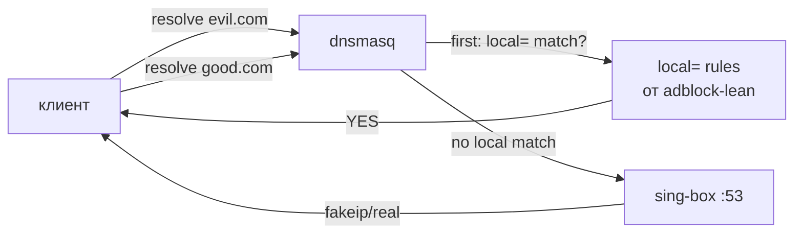

# 🚫 04. Блокировка рекламы

## TL;DR

Устанавливаем `adblock-lean` — простой скрипт, который скачивает блок-список **Hagezi Pro** (~200k доменов), сжимает в gzip, подключает к dnsmasq через `conf-script` (dnsmasq извлекает список на лету при старте). Dnsmasq возвращает NXDOMAIN на запросы ad/tracker доменов — **ДО** форварда в sing-box. Интеграция с нашим DoH-setup сохранена: что прошло фильтр — уходит в `127.0.0.42` (sing-box).

## Зачем это нужно

Современная реклама — это не просто баннеры. Это:

1. **Слежка**. Tracker-пиксели (FB Pixel, Google Analytics, Yandex Metrika) собирают поведение пользователя на сотнях сайтов. Профиль строится из действий — скомпрометированная приватность даже без VPN.
2. **Вирусы через malvertising**. Рекламные сети — распространённый вектор распространения зловредов (Spectre-эксплоиты в JS, drive-by downloads).
3. **Трафик**. На мобильном — 30-50% ответа страницы занимают ads/tracker-скрипты. Медленнее, дороже (если тариф по мегабайтам).
4. **Шум**. Субъективно — мешает читать.

Решение на уровне роутера: **блокировать на DNS-уровне**. Браузер пытается разрезолвить `doubleclick.net` → получает NXDOMAIN → не может подключиться → реклама не загружается. Универсально для **всех устройств** сети — включая «умные» TV, IoT, игровые консоли.

## Что такое adblock-lean

[lynxthecat/adblock-lean](https://github.com/lynxthecat/adblock-lean) — shell-скрипт для OpenWrt. Альтернативы:

| Решение | Комментарий |
|---|---|
| **adblock** (штатный OpenWrt) | Тяжёлый (Python), сложный, ест RAM. Излишне для наших целей. |
| **adguardhome** | Веб-UI, больше возможностей, но +50 MB RAM, +20 MB flash, + ещё один daemon. |
| **pihole** | Не для OpenWrt, требует Docker или полноценный Linux. |
| **adblock-lean** ✅ | Компактный, интегрируется напрямую в dnsmasq, zero overhead после загрузки списка. |

Для нашей задачи (один роутер, простой setup, минимум обслуживания) adblock-lean оптимален.

## Как это работает технически

### Hagezi Pro — список блокировок

Maintainer [@hagezi](https://github.com/hagezi/dns-blocklists) курирует несколько уровней блок-списков:

| Уровень | Размер | Философия |
|---|---|---|
| `hagezi:light` | ~100k | Только самые очевидные ad/tracker-домены |
| `hagezi:multi-light` | ~130k | +популярные обходы |
| **`hagezi:pro`** ✅ | **~200k** | **Рекомендованный баланс**: блок рекламы, трекеров, malvertising без ломания сайтов |
| `hagezi:multi-pro` | ~280k | Плюс соцсети-трекеры и affiliate |
| `hagezi:ultimate` | ~600k | Максимум; может ломать легитимные сервисы |
| `hagezi:pro-plus` | ~250k | Pro + threat intelligence |

Мы используем `hagezi:pro` — стандартный выбор для случая «выключи рекламу у родственников, не ломая их сервисы».

### Почему Pro не блокирует корневой `doubleclick.net`

Hagezi сознательно **не блокирует** root-домены типа:
- `doubleclick.net`
- `googleadservices.com`
- `adform.net`
- `connect.facebook.net`

Блокируются только **ad-серверы-поддомены**:
- `pagead2.googlesyndication.com` ← реальная реклама
- `securepubads.g.doubleclick.net` ← рекламный серв
- `a1.adform.net` ← CDN-ноды рекламы
- `tr.snapchat.com` ← трекер

**Почему так?** Некоторые root-домены используются **и** для рекламы, **и** для легитимного функционала:
- `graph.facebook.com` — Facebook Login SDK на сторонних сайтах. Заблокируешь — сломается вход через FB.
- `connect.facebook.net` — тот же SDK.
- `www.googletagmanager.com` — GTM грузит не только ads, но и аналитику для обычных функций (A/B-тесты и т.п.).

Pro-список консервативен: **лучше пропустить 1% рекламы**, чем сломать 1% сайтов.

### Архитектура загрузки в dnsmasq

adblock-lean использует **хитрый приём**: список хранится в gzip (1.5 MB вместо 5 MB plain text), а dnsmasq умеет читать конфиг через **shell-скрипт** (`conf-script=<path>`).

```mermaid
flowchart LR
    gz[/var/run/adblock-lean/abl-blocklist.gz<br/>1.5 MB sqashed]
    script[/tmp/dnsmasq.cfg01411c.d/.abl-extract_blocklist:<br/>gzip -cd $gz]
    dm[dnsmasq :53]
    mem[dnsmasq memory:<br/>~200k entries = ~16 MB RAM]

    gz -->|on dnsmasq start| script
    script -->|stdout: local=/bad.com/| dm
    dm --> mem

    client[клиент] -->|resolve bad.com| mem
    mem -->|NXDOMAIN| client
```

Формат строк в gzip:
```
local=/0-0-0.com/0-0-asia.com/0-100mph.com/...   # группы по 4 домена в строке
local=/doubleclick-ad.net/...
```

Dnsmasq парсит `local=/domain/` как «возвращать NXDOMAIN для этого домена и всех его поддоменов».

## Интеграция с нашим DoH-setup

Критический момент: наш dnsmasq **не резолвит сам** (`noresolv=1`), а форвардит всё в sing-box (`server=127.0.0.42`). Конфликтует ли adblock?

**Нет**, и вот почему:



Dnsmasq **сначала** проверяет `local=` правила, только при отсутствии матча форвардит upstream. Adblock срабатывает **до** DoH — это значит:
- Блокированные запросы **не вылетают** в интернет. Никакой Quad9, никакого ISP.
- Не-блокированные запросы идут в sing-box, который делает всё остальное (FakeIP, DoH к Quad9).

Две системы работают ортогонально, не мешая друг другу.

## Установка и конфигурация

### Установка

```bash
# adblock-lean ещё не в репозитории apk OpenWrt 25.12, ставим из апстрима
uclient-fetch https://raw.githubusercontent.com/lynxthecat/adblock-lean/master/abl-install.sh -O /tmp/abl-install.sh
sh /tmp/abl-install.sh -v release
```

Скрипт скачает актуальный release (на момент написания — 0.8.1), разложит файлы:
- `/etc/init.d/adblock-lean` — основной «скрипт-программа»
- `/usr/lib/adblock-lean/abl-lib.sh`, `abl-process.sh` — разбитый на модули код
- `/etc/adblock-lean/config` — конфигурация

Ключевые команды:
```bash
/etc/init.d/adblock-lean gen_config     # сгенерировать default-конфиг
/etc/init.d/adblock-lean enable         # добавить в автозагрузку
/etc/init.d/adblock-lean start          # запустить: скачать список, применить
/etc/init.d/adblock-lean status         # проверить статус
/etc/init.d/adblock-lean setup          # interactive-меню для настройки
```

### Конфигурация (`/etc/adblock-lean/config`)

Основные параметры:
```ini
# config_format=v11

# Блок-лист: Hagezi Pro через shortcut-синтаксис
raw_block_lists="hagezi:pro"

# Allow-list (если нужно что-то разблокировать)
# local_allowlist_path="/etc/adblock-lean/allowlist"

# Тест-домены для проверки после загрузки (если не резолвятся — откат)
test_domains="google.com microsoft.com amazon.com"

# Что делать, если часть списка не скачалась
list_part_failed_action="SKIP"   # SKIP | STOP

# Лимиты безопасности: не применять подозрительно маленький список
min_blocklist_file_part_line_count=1
max_blocklist_file_parts=30

# Автообновление (adblock-lean сам добавляет cron)
# update_frequency по умолчанию — раз в сутки
```

### Как adblock-lean подключается к dnsmasq

Adblock-lean **автоматически** добавляет в `/etc/config/dhcp`:
```
option addnmount '/bin/busybox' '/var/run/adblock-lean/abl-blocklist.gz'
```

И кладёт в `/tmp/dnsmasq.cfg01411c.d/abl-conf-script`:
```
conf-script="busybox sh /tmp/dnsmasq.cfg01411c.d/.abl-extract_blocklist"
```

И сам `abl-extract_blocklist`:
```sh
/bin/busybox gzip -cd "/var/run/adblock-lean/abl-blocklist.gz"
exit 0
```

Dnsmasq при старте выполняет этот скрипт, забирает stdout как свой конфиг.

> ⚠️ **После установки adblock-lean надо перезапустить dnsmasq** (`/etc/init.d/dnsmasq restart`), чтобы список загрузился. Скрипт установки делает это, но если apply блок-листа пошёл через `reload_config`, иногда требуется явный `restart`.

## Диагностика

```bash
# Работает ли?
/etc/init.d/adblock-lean status

# Сколько доменов заблокировано?
wc -l < <(zcat /var/run/adblock-lean/abl-blocklist.gz | tr '/' '\n')
# >>> ~200000

# Проверить блокировку конкретного домена
nslookup pagead2.googlesyndication.com 192.168.1.1
# >>> пустой ответ = BLOCKED

# Проверить, что легитимный резолвится
nslookup google.com 192.168.1.1
# >>> 108.177.x.x или подобное

# Логи
logread | grep -i adblock | tail -20
```

### Известные особенности

**1. Закэшированные IP.** Если раньше резолвился `doubleclick.net` → 142.250.x.x и закэшировался в клиентском ОС или в dnsmasq (у нас cache=0 в dnsmasq, но клиентский может иметь), первые несколько минут после установки блок не сработает. Решение: `killall -HUP dnsmasq`, очистить кэш клиента (перезагрузить браузер).

**2. Если список не скачался.** adblock-lean выполняет **rollback**: если после применения нового списка домены из `test_domains` перестают резолвиться → восстанавливает backup предыдущего списка. Если backup'а нет — отключается. Проверка: `/etc/init.d/adblock-lean status`.

**3. YouTube ads.** Hagezi Pro НЕ блокирует inline-рекламу YouTube — YouTube доставляет её с **тех же** CDN-серверов, что и контент видео. Заблокировать ads — значит заблокировать весь YouTube. Для YouTube-адов нужны другие методы (SponsorBlock, uBlock Origin в браузере).

## Альтернативные списки

Если Pro показался слишком мягким/жёстким, смените `raw_block_lists`:

```bash
# В /etc/adblock-lean/config:
raw_block_lists="hagezi:multi-pro"        # +трекеры соцсетей
# или
raw_block_lists="hagezi:ultimate"         # максимум; будут ложные блоки
# или комбинация:
raw_block_lists="hagezi:pro oisd:big"     # Pro + OISD big list

/etc/init.d/adblock-lean start             # применить
```

Популярные источники:
- **Hagezi** — качественный, активно поддерживаемый, разные уровни
- **OISD (Big / Small)** — минималистичный, консервативный
- **StevenBlack's hosts** — агрегация множества списков
- **1Hosts** — умеренный баланс

## Почему так, а не иначе

### Почему не в браузере (uBlock Origin)?

**uBlock Origin** — отличный блокировщик для **одного** устройства. Но:
- Не работает на iOS Safari, TVs, игровых консолях, IoT
- Каждое устройство надо настраивать отдельно
- Мобильные браузеры (Chrome на Android) не дают установить расширения

**Router-level adblock** покрывает всё, что пользуется роутером. uBO — это дополнение для тех, кто хочет **ещё сильнее** блокировать (он умеет вырезать элементы на странице, не только DNS).

> 💡 **Наилучший сценарий:** наш router-level adblock + uBlock Origin в браузере. Пересечение почти 100%, «в лес» выбивают оставшиеся 1-2% домен-баннеров.

### Почему DNS-уровень, а не HTTP-прокси

HTTP-прокси (например, Privoxy) может вырезать элементы страницы на лету. Но:
- Требует настройки прокси в браузере
- Не работает для HTTPS без MITM-сертификата (= сломать TLS)
- Ресурсоёмкий (parsing HTML/JS)

DNS-уровень: zero-config для клиента, работает для HTTPS, простой и надёжный.

### Почему Hagezi Pro, а не самый большой `ultimate`?

Проверено на практике: `ultimate` блокирует **необычные** домены, которые иногда используются легитимными сервисами. Типичные репорты: «не работает вход в онлайн-банк», «сломался telegram-login на сайте». Pro — минимум ложных срабатываний.

Для нашей цели («чтобы у родственников просто работало») Pro — правильный уровень.

## Проверь себя

1. **Зачем adblock-lean сжимает список в gzip вместо plain-text файла?**
   <details><summary>Ответ</summary>Экономия **flash**. Plain-text 200k `local=/...` строк весит ~5 MB. Gzip сокращает в ~3-4 раза. На embedded-устройствах с 200 MB overlay это существенно. При старте dnsmasq gunzip на лету без заметных задержек.</details>

2. **Что произойдёт, если adblock-lean не смог скачать обновление списка?**
   <details><summary>Ответ</summary>При `list_part_failed_action="SKIP"` пропускает только неработающие части, остальные применяет. Если вообще ничего не скачалось — оставляет предыдущий рабочий список. Если `test_domains` перестали резолвиться после применения нового списка — делает rollback к backup. Система «fail-safe».</details>

3. **Почему нельзя использовать adblock-lean без нашего setup'а с podkop?**
   <details><summary>Ответ</summary>Можно! adblock-lean работает **независимо**. Наш setup: dnsmasq → sing-box (DoH). adblock-lean просто добавляет `local=/domain/` правила в dnsmasq. Без sing-box: dnsmasq → ISP DNS. adblock тоже сработает. Это ортогональные системы.</details>

## 📚 Глубже изучить

### Обязательно
- [adblock-lean GitHub](https://github.com/lynxthecat/adblock-lean) — основная доку
- [Hagezi DNS Blocklists](https://github.com/hagezi/dns-blocklists) — автор списка, подробности о каждом уровне
- [dnsmasq man page](https://thekelleys.org.uk/dnsmasq/docs/dnsmasq-man.html) — для `local=`, `conf-script`, `server=` директив

### Желательно
- [PowerDNS Blog: DNS-based ad blocking](https://blog.powerdns.com/2015/03/27/dns-based-filtering/) — как это устроено концептуально
- [Yandex Radar: доля трафика, связанного с рекламой](https://radar.yandex.ru/) — почувствовать масштаб

### Для любопытных
- [Malvertising 101 (Kaspersky)](https://www.kaspersky.com/resource-center/definitions/malvertising) — как реклама становится вектором атаки
- 📺 [How Ad Networks Work (Stanford CS 253)](https://web.stanford.edu/class/cs253/) — академическая лекция про устройство рекламных сетей
- [OISD.nl](https://oisd.nl/) — альтернативный курируемый список, почитать их философию
