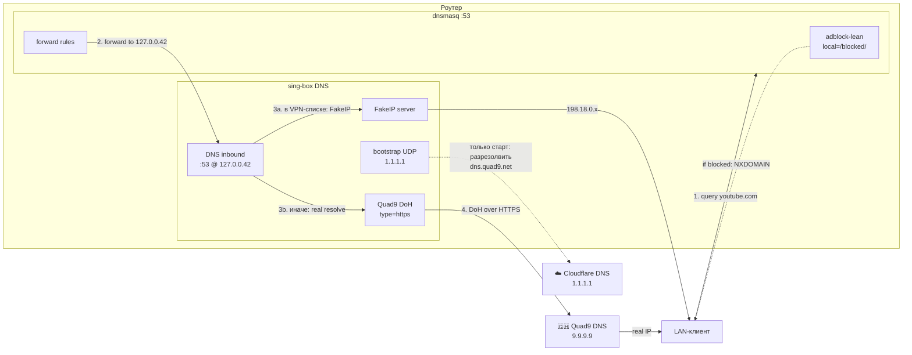
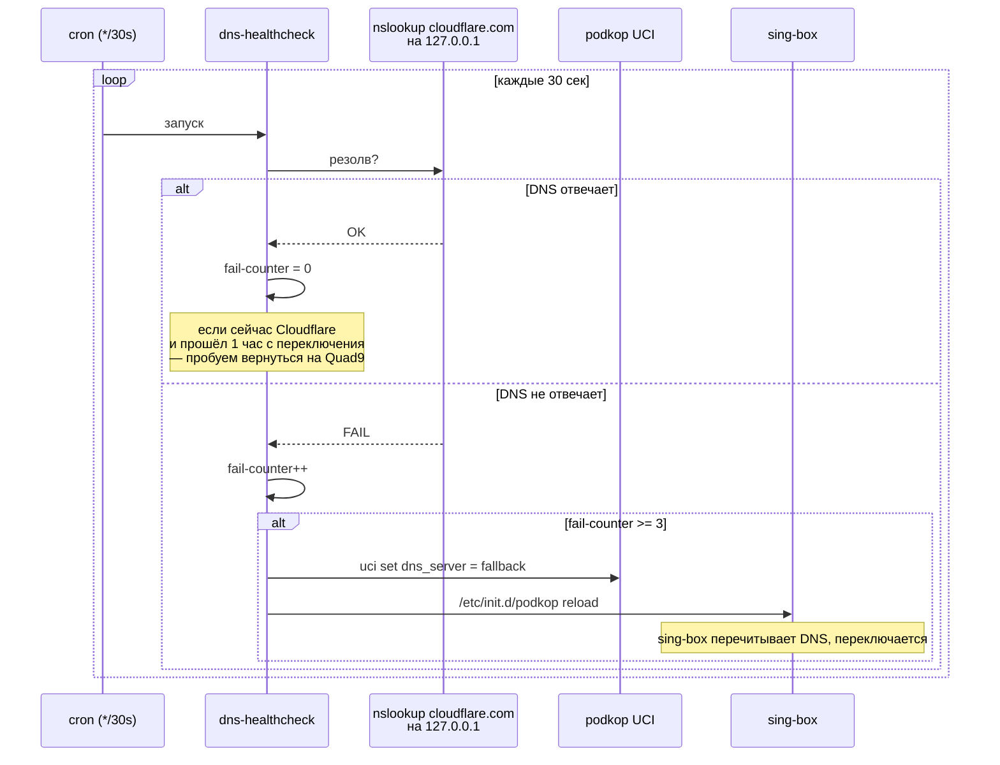

# 🔒 05. DNS: Quad9 DoH + автофейловер

## TL;DR

Основной DNS — **Quad9 DoH** (`dns.quad9.net/dns-query`). Bootstrap (для разрезолва Quad9-хоста на старте) — Cloudflare UDP `1.1.1.1`. Fallback при сбое — Cloudflare DoH. CLI `dns-provider` для ручного свитча, `dns-healthcheck` в cron каждые 30 сек для автофейловера. На уровне dnsmasq **до** sing-box работает adblock-lean (см. [04-adblock.md](04-adblock.md)).

## Зачем всё это

### Проблемы «наивного» DNS

Если роутер использует стандартный DNS от провайдера (что делает 95% домашних сетапов по умолчанию), получаем:

1. **Провайдер видит все домены**, которые вы запрашиваете. Включая заблокированные. Это главный метаданных-канал для слежки.
2. **Провайдер может подменять ответы.** В РФ ISP активно возвращают подменённые IP-адреса для заблокированных сайтов — вместо реального IP вы получаете страницу-заглушку Роскомнадзора.
3. **DNS Hijacking** — более серьёзная атака, когда злоумышленник (не обязательно государство) перенаправляет на фишинг-страницу.

### Как решается

**DoH (DNS over HTTPS)** — RFC 8484, 2018. DNS-запросы идут **внутри HTTPS-соединения** к доверенному резолверу. Провайдер видит только «TLS-соединение к 1.1.1.1:443», не содержимое запросов. Невозможно подменить ответ (TLS гарантирует целостность).

Альтернатива — **DoT (DNS over TLS)** — RFC 7858. Похоже на DoH, но использует порт **853** и явно идентифицируется как DNS. DoH лучше для обхода цензуры: выглядит как обычный HTTPS.

## Архитектурная схема



## Почему Quad9

Критерии выбора DNS-провайдера:

| Критерий | Quad9 | Cloudflare | Google | Yandex |
|---|---|---|---|---|
| **Юрисдикция** | 🇨🇭 Швейцария | 🇺🇸 США | 🇺🇸 США | 🇷🇺 РФ |
| **14-Eyes** | Нет | Да (alignment) | Да | N/A |
| **Privacy policy** | No-log | Кэш 24ч | Ограниченный лог | Полное логирование |
| **DoH поддержка** | Да | Да | Да | Частичная |
| **Malware-блокировка** | Встроена | Нет (но есть 1.1.1.3) | Нет | Есть «безопасный» 77.88.8.7 |
| **Anycast (близость)** | Да, глобально | Да, глобально | Да | Только RU |
| **Независимость** | Non-profit | Commercial | Commercial | Commercial + рос. гос. |

**Quad9** — нетривиальный выбор: 
- **Швейцарская non-profit организация** ([Quad9 Foundation](https://www.quad9.net/)), совместная с IBM и Packet Clearing House
- **Официально рекомендован** Mozilla (как trusted DoH), BSI (федеральной службе инфобеза Германии), и EFF
- **Block-list вредоносных доменов** встроен бесплатно — дополнительная защита от фишинга
- **Швейцарское законодательство** о приватности — одно из самых жёстких в мире, вне ЕС-директив о data retention

**Cloudflare 1.1.1.1** — отличный secondary. Быстрый, надёжный, technically заявляет no-log. Но:
- США, подпадает под юрисдикцию Patriot Act
- Commercial-компания с commercial-интересами (данные — currency)

Наш выбор: **Quad9 primary, Cloudflare fallback**. Защита от блокировки Quad9 Роскомнадзором (если такое случится) + лучший privacy-профиль в штатной работе.

## Архитектура failover



Логика в `/usr/bin/dns-healthcheck`:
- **Нормально:** Quad9 работает → counter = 0.
- **3 fail'а подряд** (≈1.5 мин недоступности) → свитч на Cloudflare.
- **Каждый час** при активном Cloudflare — пробуем вернуться на Quad9 (проверяем 9.9.9.9 напрямую).
- Cron задан каждую минуту + offset 30 сек через `sleep 30 && ...` для эффективных 30-секундных интервалов.

## Важная тонкость: DoH не идёт через VPN

Вот тут есть подводный камень, о котором стоит знать честно.

**Желаемое:** все DNS-запросы (включая DoH) идут через AWG → Swiss exit → Quad9. Так Quad9 не видит настоящий IP пользователя.

**Реальность:** sing-box с `auto_detect_interface: true` биндит outbound-сокеты к дефолтному интерфейсу — а это eth0 (WAN), не awg0. Попытки навязать маршрут для 9.9.9.9 через awg0 игнорируются sing-box'ом.

**Решения, которые рассматривались:**
1. **Patch sing-box config** через post-processing. Отвергнуто: **хрупко**. Podkop перегенерирует конфиг на каждом reload, наш патч слетит.
2. **Подменить подkop'овский скрипт генерации** — да, но это ломает совместимость с обновлениями подkop.
3. **Запустить отдельный sing-box-процесс** только для DNS с `bind_interface=awg0` — overkill.
4. **Использовать `detour`-поле DNS сервера** — podkop не выставляет его по UCI.

**Принятое решение:** оставить DoH direct-through-WAN. Что теряем:
- Quad9 видит RU-IP клиента (не CH). Privacy-минус.
- Если Роскомнадзор заблокирует 9.9.9.9 → DNS сломается (failover на 1.1.1.1, если и его заблокируют — беда).

Что сохраняем:
- **Зашифрованность запросов** (DoH over HTTPS). ISP видит только TLS-handshake к 9.9.9.9:443, не запросы.
- **Автофейловер** спасает от блокировки одного из резолверов.

Компромисс: **≈90% выгоды от идеального сетапа, 10% приватности теряем в обмен на надёжность**. Для цели «работать у родственников 5 лет без моих вмешательств» — правильный баланс.

## UCI-конфигурация

```ini
# /etc/config/podkop
config settings 'settings'
    option dns_type 'doh'
    option dns_server 'dns.quad9.net/dns-query'
    option bootstrap_dns_server '1.1.1.1'
    # ...
```

Когда `dns_type='doh'`, podkop генерирует в sing-box:
```json
{
  "servers": [
    {
      "tag": "bootstrap-dns-server",
      "type": "udp",
      "server": "1.1.1.1",
      "server_port": 53
    },
    {
      "tag": "dns-server",
      "type": "https",
      "server": "dns.quad9.net",
      "server_port": 443,
      "path": "/dns-query",
      "domain_resolver": "bootstrap-dns-server"
    },
    {
      "tag": "fakeip-server",
      "type": "fakeip",
      "inet4_range": "198.18.0.0/15"
    }
  ]
}
```

Bootstrap используется **один раз при запуске** sing-box — чтобы разрезолвить `dns.quad9.net` → `9.9.9.9`. Дальше DoH работает напрямую, bootstrap не трогается.

## CLI-утилиты

### `dns-provider` — ручной свитч

```bash
dns-provider status
# Active: Quad9 DoH (dns.quad9.net/dns-query)
# Bootstrap: 1.1.1.1
# Type: doh

dns-provider cloudflare         # → cloudflare-dns.com/dns-query
dns-provider quad9              # вернуть на Quad9
```

Меняет UCI-опцию, коммитит, триггерит reload podkop. Работает мгновенно (~2-3 сек).

### `dns-healthcheck` — автофейловер

Запускается cron'ом, не вызывается вручную (но можно для теста):
```bash
/usr/bin/dns-healthcheck           # одна итерация проверки
logread -t dns-health | tail       # посмотреть историю
```

Состояние хранит в `/tmp/dns-health/` (teardown'ится при ребуте — это OK, свежий старт).

## Диагностика

```bash
# Какой DNS сейчас активен
dns-provider status

# Проверить, что sing-box слушает DoH target
netstat -tlnp | grep sing-box
# >>> 127.0.0.42:53

# Проверить, что dnsmasq форвардит в sing-box
uci show dhcp | grep -E 'server|noresolv'
# >>> server='127.0.0.42', noresolv='1'

# Реальный тест резолвинга
nslookup cloudflare.com 192.168.1.1

# Посмотреть что резолвится: реальный IP или FakeIP?
nslookup youtube.com 192.168.1.1
# >>> 198.18.0.x — FakeIP, хорошо, пойдёт через VPN
nslookup yandex.ru 192.168.1.1
# >>> реальный 5.255.x.x — OK, пойдёт direct

# Логи
logread -t dns-provider | tail
logread -t dns-health | tail
logread | grep 'sing-box' | grep -i dns | tail -20
```

## Типичные проблемы

### «Интернет не работает, но Wi-Fi подключен»

Проверьте:
1. `awg show awg0 | grep handshake` — VPN жив?
2. `dns-provider status` — DNS активен?
3. `/etc/init.d/sing-box status` — sing-box запущен?

Если всё OK — попробуйте `nslookup google.com 192.168.1.1`. Ответа нет → проблема в DNS-tier. Есть ответ но сайт не открывается → проблема в routing-tier (см. [docs/03](03-podkop-routing.md)).

### Очень медленный первый запрос после перезагрузки

Нормально. Сценарий:
1. sing-box запускается → тайммит запрос к `1.1.1.1` (bootstrap)
2. Разрезолвит `dns.quad9.net` → `9.9.9.9`
3. Установит TLS-соединение к `9.9.9.9:443`
4. Первый DoH-запрос — с полным handshake'ом

Итого — 2-3 секунды на первый запрос. Последующие — subms, TLS-соединение переиспользуется.

### Provider свопнулся на Cloudflare и не возвращается

Проверьте `logread -t dns-health`. Возможно, Quad9 всё ещё недоступен с вашей сети. Посмотрите 1-часовую статистику попыток возврата. Если нужно — `dns-provider quad9` вручную.

## Проверь себя

1. **Почему bootstrap — UDP, а не DoH?**
   <details><summary>Ответ</summary>Chicken-and-egg: чтобы сделать DoH-запрос к `dns.quad9.net`, нужно знать IP этого хоста. А чтобы узнать IP — нужно сделать DNS-запрос куда-то. Если bootstrap тоже DoH, нужно ещё один bootstrap для него, и т.д. Bootstrap — это самое простое: UDP:53 к известному IP. Один раз при старте, не часто.</details>

2. **Что будет, если и Quad9, и Cloudflare заблокируют?**
   <details><summary>Ответ</summary>DNS-сломается полностью. Сайты не будут открываться (не резолвится ни один домен). Нужно вручную настроить `dns-provider` на другого провайдера — например, `dns.adguard-dns.com/dns-query`. В долгосрочной перспективе нужен более robust-список fallback'ов (AdGuard, NextDNS, Mullvad и т.п.).</details>

3. **Почему adblock работает на dnsmasq, а не на sing-box?**
   <details><summary>Ответ</summary>Технически — можно было бы на обоих, но на dnsmasq проще: `local=/domain/` — одна строчка, мгновенно применяется. Sing-box поддерживает rule_set-based rejection, но требует другого синтаксиса и перегенерации конфига. Кроме того, adblock-lean дёргает только dnsmasq через conf-script — sing-box конфиг не трогается. Разделение ответственности: dnsmasq = фильтр, sing-box = маршрутизация.</details>

## 📚 Глубже изучить

### Обязательно
- [RFC 8484: DNS Queries over HTTPS (DoH)](https://datatracker.ietf.org/doc/html/rfc8484) — спецификация DoH
- [Quad9: About page](https://www.quad9.net/about/) — кто они такие и откуда
- [Cloudflare 1.1.1.1 documentation](https://developers.cloudflare.com/1.1.1.1/) — альтернатива

### Желательно
- [Mozilla: Trusted Recursive Resolvers](https://wiki.mozilla.org/Security/DOH-resolver-policy) — критерии «доверенного» DoH-провайдера
- [IETF: Padme padding for DNS queries](https://datatracker.ietf.org/doc/html/rfc8467) — почему DNS-запросы могут «сливать» длину имени даже в DoH
- [Cloudflare Learning: What is DNS?](https://www.cloudflare.com/learning/dns/what-is-dns/) — базовый ликбез

### Для любопытных
- [Bill Woodcock's talk on Quad9 architecture](https://www.youtube.com/watch?v=UKnWhe4XGiE) — подробности от сооснователя
- [DNS over HTTPS vs DNS over TLS (EFF)](https://www.eff.org/deeplinks/2018/04/dns-over-https-improving-privacy) — фундаментальный разбор
- 📺 [Computerphile: DNS over HTTPS](https://www.youtube.com/watch?v=7-bN1xx1oOE) — 15 минут наглядно
