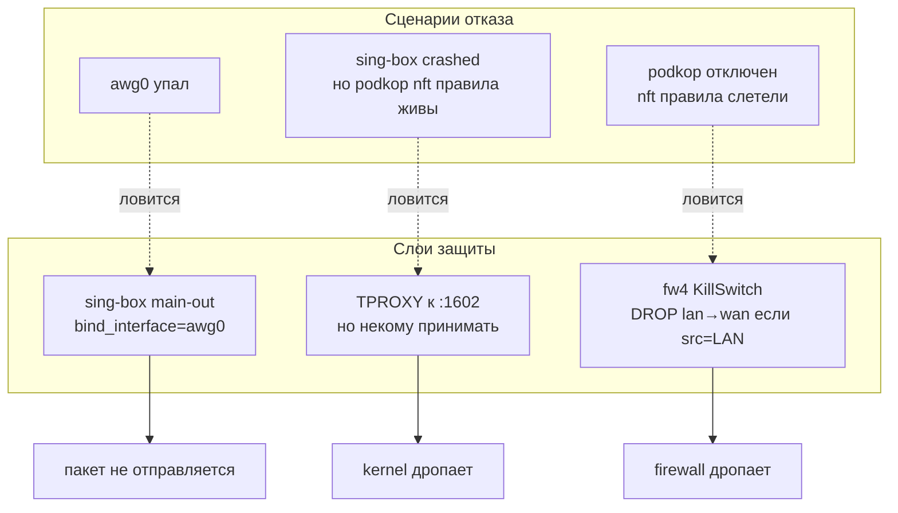

# 🛡 08. Kill switch и защита от утечек

## TL;DR

**Defense-in-depth — три независимых слоя**. (1) `main-out` в sing-box биндится к `awg0` — если интерфейс мёртв, sing-box не может отправить пакет. (2) nftables tproxy-правило podkop'а редиректит LAN-пакеты на `127.0.0.1:1602`; если sing-box упал — kernel TPROXY дропает (нет слушающего сокета). (3) fw4-правило `KillSwitch-*` в forward chain дропает любой пакет с source `192.168.1.0/24`, который каким-то образом обошёл tproxy. Каждый слой закрывает свой класс отказов.

## Что такое «утечка VPN»

Цель VPN для цензуры: скрыть, что вы обращаетесь к определённым сайтам. Но если:

1. **VPN-интерфейс падает** (handshake протух, сервер недоступен, AWG crashed),
2. **Routing-слой ломается** (sing-box crashed, podkop отключен),
3. **Пакет обошёл фильтр** (edge case в nftables, неожиданный протокол),

— возможна ситуация, когда приложение клиента пытается подключиться к youtube.com, пакет **не попадает в туннель**, идёт через обычный WAN, **раскрывая ваш реальный IP** внешним сервисам и **давая провайдеру** увидеть что вы ходите на youtube.

Это называется **VPN leak**. Kill switch — механизм, гарантирующий, что при сбое VPN происходит **fail-closed** (отказ в доступе), а не **fail-open** (незащищённый доступ).

## Принцип defense-in-depth

Один слой защиты — плохо: если он сломается, всё открыто. Три ортогональных слоя — хорошо: каждый закрывает свой класс проблем, одновременный отказ всех маловероятен.



Детально каждый слой:

## Слой 1: sing-box bind_interface

В sing-box конфиге:
```json
{
  "type": "direct",
  "tag": "main-out",
  "bind_interface": "awg0"
}
```

`bind_interface` → `setsockopt(SO_BINDTODEVICE)` на сокете. При отправке kernel проверяет, что отправка идёт именно через указанный интерфейс.

**Если awg0 down** (interface `DOWN`, нет adresса), или нет маршрута для destination через awg0 — sing-box получает от ядра ошибку `EHOSTUNREACH` или `ENETDOWN`. Пакет не уходит.

Клиентское приложение видит таймаут соединения. Не получает direct-ответ через WAN — потому что sing-box не пытается отправить через WAN, он специально биндит awg0.

**Что НЕ ловит этот слой:** если sing-box **сам** не работает. Тогда пакет до уровня «sing-box пытается отправить» не доходит.

## Слой 2: TPROXY без listening socket

nftables-правило podkop'а:
```nft
chain proxy {
    type filter hook prerouting priority dstnat; policy accept;
    meta mark & 0x00100000 == 0x00100000 meta l4proto tcp tproxy ip to 127.0.0.1:1602 counter
    meta mark & 0x00100000 == 0x00100000 meta l4proto udp tproxy ip to 127.0.0.1:1602 counter
}
```

TPROXY action в Linux — специальная штука. Обычный `iptables -j REDIRECT` изменяет destination IP. TPROXY **не меняет** IP — вместо этого он отдаёт пакет локальному сокету с `IP_TRANSPARENT` опцией на указанном порту.

Если на `127.0.0.1:1602` **никто не слушает** (sing-box упал или не стартовал), TPROXY не может доставить пакет. Kernel **молча дропает** пакет.

**Доказано в тестах** (см. [09-troubleshooting.md](09-troubleshooting.md)):
- stop sing-box
- curl to 1.1.1.1 from LAN client
- пакет не проходит, таймаут
- kill switch counter (fw4) остаётся 0 — до него пакет не доходит
- виновник — TPROXY drop на уровне kernel

**Что НЕ ловит этот слой:** если сами nft-правила podkop'а **отсутствуют** (`/etc/init.d/podkop stop`). Тогда mangle/tproxy chain нет, пакет не маркируется, идёт в обычный FORWARD chain → в WAN.

## Слой 3: fw4 KillSwitch в forward chain

Это наш основной явный kill switch, настраиваемый через UCI:

```ini
# /etc/config/firewall
config rule
    option name 'KillSwitch-IPv4-LAN-direct-egress'
    option src 'lan'
    option dest 'wan'
    option family 'ipv4'
    option src_ip '192.168.1.0/24'
    option proto 'all'
    option target 'DROP'

config rule
    option name 'KillSwitch-IPv6-LAN-direct-egress'
    option src 'lan'
    option dest 'wan'
    option family 'ipv6'
    option proto 'all'
    option target 'DROP'
```

Логика: **любой** пакет, имеющий src в диапазоне LAN-клиентов (`192.168.1.0/24`) и пытающийся покинуть wan-интерфейс, **дропается**.

**В штатной работе** (podkop жив, sing-box жив) этот счётчик **равен нулю**. Почему? Потому что:
1. LAN-пакет приходит в роутер через `br-lan` (ingress)
2. Проходит PREROUTING → nftables mangle (маркируется podkop'ом)
3. Проходит PREROUTING → proxy chain (tproxy-редиректится на sing-box)
4. **Не доходит до FORWARD** — он доставлен локально через TPROXY

После обработки sing-box'ом, **новый** пакет создаётся с **новым source IP** (это уже router IP, не LAN). Он отправляется через awg0 (main-out) или eth0 (direct-out, для RU). В обоих случаях source != 192.168.1.x → kill switch не матчит.

**Когда срабатывает этот слой:** если podkop полностью сломан, nft-правила отсутствуют. Тогда LAN-пакет:
1. PREROUTING → ничего особенного не происходит
2. FORWARD (lan→wan) → **KillSwitch правило матчит** → DROP.

Пакет не выходит, утечки нет.

## Что НЕ входит в kill switch

Есть трафик, который **НЕ** должен блокироваться kill switch'ем:

1. **Router-originated traffic.** DoH-запросы sing-box'а к Quad9, обновления apk-repo, NTP, cron-задачи скачивания блок-списков. Они идут через OUTPUT chain (не FORWARD). Source IP — router'а самого. Наше правило не матчит.
2. **LAN-LAN traffic.** Связь между клиентами внутри 192.168.1.0/24 (принтер-ноутбук). Не проходит через forward wan-zone, правило не матчит.
3. **WAN → LAN.** Входящий трафик от ответов на наши outgoing (conntrack related established). Наше правило про src=LAN, т.е. outgoing. Incoming не трогает.
4. **RU-исключения через direct-out.** Это трафик от sing-box'а (источник = router IP), не от LAN-клиентов. Не матчит.

## Установка

В UCI:
```bash
uci add firewall rule
uci set firewall.@rule[-1].name='KillSwitch-IPv4-LAN-direct-egress'
uci set firewall.@rule[-1].src='lan'
uci set firewall.@rule[-1].dest='wan'
uci set firewall.@rule[-1].family='ipv4'
uci set firewall.@rule[-1].src_ip='192.168.1.0/24'
uci set firewall.@rule[-1].proto='all'
uci set firewall.@rule[-1].target='DROP'

uci add firewall rule
uci set firewall.@rule[-1].name='KillSwitch-IPv6-LAN-direct-egress'
uci set firewall.@rule[-1].src='lan'
uci set firewall.@rule[-1].dest='wan'
uci set firewall.@rule[-1].family='ipv6'
uci set firewall.@rule[-1].proto='all'
uci set firewall.@rule[-1].target='DROP'

uci commit firewall
/etc/init.d/firewall reload
```

## Проверка работоспособности

### Тест 1: штатная работа (killswitch на страже, но не срабатывает)

```bash
# Counter должен оставаться 0
nft -a list chain inet fw4 forward_lan | grep -i killswitch
# packets 0 bytes 0
```

### Тест 2: simulate sing-box crash (TPROXY layer сработает)

```bash
/etc/init.d/sing-box stop
# С LAN-клиента: curl http://1.1.1.1/ → timeout
# Counter killswitch всё ещё 0 (пакет дропнут TPROXY выше)
nft -a list chain inet fw4 forward_lan | grep -i killswitch
/etc/init.d/sing-box start
```

### Тест 3: simulate podkop full failure (KillSwitch layer сработает)

⚠️ Не рекомендую делать на работающем роутере — сложно восстановить:

```bash
# Flush podkop's nft table
nft delete table inet PodkopTable
# LAN-клиент: curl http://1.1.1.1/ → timeout (killswitch дропает)
nft -a list chain inet fw4 forward_lan | grep -i killswitch
# packets > 0 !!! — убедились, что killswitch поймал
# Восстановить:
/etc/init.d/podkop restart
```

## Что НЕ защищает kill switch

Честно о границах:

- **DNS leak через другие каналы.** Если клиент делает DoH прямо к Cloudflare (некоторые Chrome/Firefox настроены с DoH=secure mode), минуя наш DNS, — kill switch не знает, что это DNS-запрос, и если он идёт через туннель — нормально. Если через WAN — blocked. Всё равно OK.
- **IPv6 ULA traffic** (`fd00::/8`, link-local). Наш IPv6-rule матчит только из LAN в WAN. ULA-addresses не выходят за LAN по дизайну.
- **Нестандартные клиенты на роутере.** Скрипты, которые сами отправляют packets (скажем, custom Python scraper запущенный на роутере напрямую). Их src будет router IP, не 192.168.1.x. Kill switch не защитит. Но это и не «утечка» — это явное намерение пользователя.
- **Физическая атака.** Если злоумышленник подключился Ethernet-кабелем в роутер, его MAC добавится в bridge. Kill switch рассматривает его как LAN-клиента — т.е. он попадёт под защиту. Но если он сначала сбросит роутер через recovery — всё, конфига нет.

## Альтернативы, которые не выбрали

### «Kill switch через отключение WAN-интерфейса»

Идея: когда AWG падает, автоматически `ifdown wan`. Никто никуда не ходит.

**Проблемы:**
- Сам роутер перестаёт резолвить DNS (bootstrap нужен WAN)
- Не может переустановить туннель (endpoint не достижим)
- NTP умирает → TLS сломается из-за неверного времени → DoH сломается → deadlock
- LAN-клиенты теряют DHCP leases

Подход годится для программного VPN (NordVPN-app закрывает сетевой интерфейс клиента). Для роутера — вреден.

### «Kill switch через policy routing + default route only through awg0»

Идея: default route на роутере через awg0. При падении — default route исчезает → любой outgoing пакет kernel дропает с «no route to host».

**Проблемы:**
- Роутер **сам** тоже теряет DNS/NTP/updates
- Split routing (RU через WAN) ломается — приходится писать много policy rules
- Сложнее дебажить

Наше решение проще: точечный kill switch для конкретного паттерна утечки, не ломая остальной роутер.

### «Применять kill switch только при падении VPN»

Идея: watchdog проверяет AWG, при падении добавляет DROP rule, при восстановлении — удаляет.

**Проблемы:**
- Race condition: между моментом «VPN упал» и «watchdog добавил rule» — окно утечки.
- Если сам watchdog упадёт — защита отсутствует.

Наше решение: kill switch **всегда** активен. В штатной работе — не срабатывает (никто не пытается обойти tproxy). При аварии — мгновенно блокирует.

## Проверь себя

1. **Пользователь на ноуте пингует `8.8.8.8`. Что произойдёт пакет за пакетом?**
   <details><summary>Ответ</summary>
   
   1. Ноут: ICMP Echo с src=192.168.1.5, dst=8.8.8.8.
   2. Роутер ingress br-lan.
   3. nft mangle (podkop): правило `iifname @interfaces ip saddr 192.168.1.0/24 meta l4proto tcp meta mark set 0x00100000` — **только для TCP и UDP**, ICMP не маркируется!
   4. PREROUTING proxy chain: не маркирован → не tproxy'ится.
   5. FORWARD chain (lan→wan): **KillSwitch правило матчит** (src=192.168.1.0/24) → DROP.
   6. Пинг не проходит — как и задумано (ICMP к WAN от LAN в принципе не полезная штука, её и блокируем).
   
   Вывод: kill switch блокирует **и** ICMP. Если кому-то нужно пинговать из-под VPN — нужен curl через наш прокси, а не прямой ping.
   </details>

2. **Что произойдёт, если кто-то на LAN-ноуте запустит `ssh admin@server-in-russia`?**
   <details><summary>Ответ</summary>
   SSH: TCP handshake с src=192.168.1.5, dst=server. В sing-box: sniffing TCP не видит доменного имени (SSH шлёт ClientHello не с SNI, а с собственным банером `SSH-2.0`). Sing-box видит только IP назначения. Если IP в списке exclusion — direct-out. Если нет — main-out (VPN). В типичном .ru-сценарии — direct.
   </details>

3. **Как злоумышленник на Wi-Fi может попытаться обойти kill switch?**
   <details><summary>Ответ</summary>
   Практически никак. Он — LAN-клиент с src=192.168.1.x. Любой его outgoing пакет на WAN попадает под одно из трёх правил защиты. Даже если он будет использовать raw sockets, спуфить пакеты — трафик всё равно должен покинуть роутер через eth0, где на него смотрит kill switch. Единственный способ «обойти» — физически подключить другой WAN-канал (e.g., телефон как hotspot) и использовать его напрямую, минуя наш роутер. Но это уже не «обход» — это «не использовать нашу сеть».
   </details>

## 📚 Глубже изучить

### Обязательно
- [nftables Wiki: Traverse chains](https://wiki.nftables.org/wiki-nftables/index.php/Configuring_chains) — как ходят пакеты через цепочки
- [Linux TPROXY documentation](https://www.kernel.org/doc/html/latest/networking/tproxy.html) — внутренности TPROXY

### Желательно
- [Packet flow in Netfilter](https://upload.wikimedia.org/wikipedia/commons/3/37/Netfilter-packet-flow.svg) — знаменитая картинка про прохождение пакета
- [OpenWrt: Firewall 4 (fw4)](https://openwrt.org/docs/guide-user/firewall/fw3_configurations/fw4-configurations) — наш firewall
- [VPN leak testing (EFF + various)](https://dnsleaktest.com/) — как проверять утечки

### Для любопытных
- [WireGuard best practices: kill switch with iptables](https://www.procustodibus.com/blog/2021/01/wireguard-killswitch/) — рекомендации автора WG
- [Mullvad: How our kill switch works](https://mullvad.net/en/help/firewall-mullvad-vpn-app/) — индустриальный подход
- 📺 [Network Chuck: VPN leaks and how to stop them](https://www.youtube.com/watch?v=6sVDk38AMBQ) — понятный разбор
