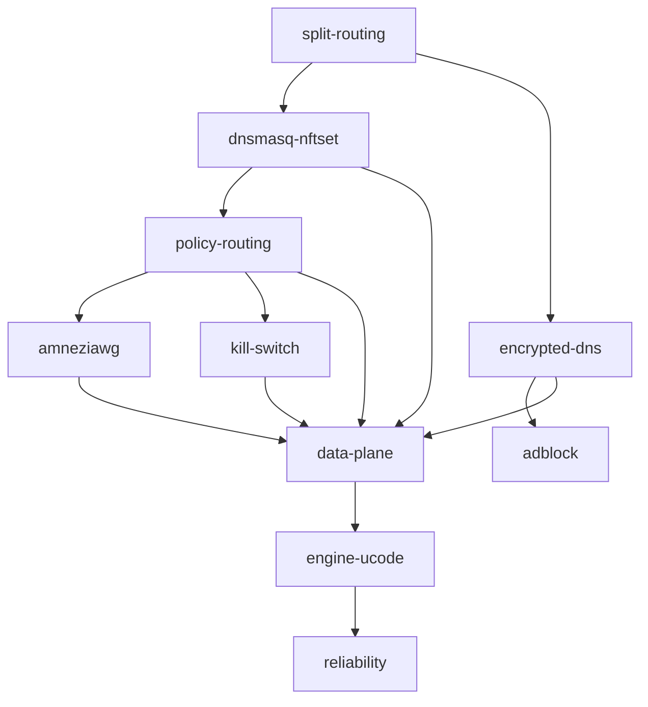

# База знаний cheburnet-router

Obsidian-vault: документация «от первых принципов», одинаково удобная человеку (граф заметок) и
ИИ (чистый markdown как контекст). Открыть: папку `docs/kb/` как vault в Obsidian, или просто
читать на GitHub — ссылки кликабельны. Как кормить ИИ — [[conventions#Для ИИ]].

> [!tip] TL;DR проекта
> Роутер на OpenWrt: **домены из direct-списка — напрямую, остальной интернет — через VPN-туннель**,
> плюс блокировка рекламы и защита от утечек. Реализовано на примитивах ядра (без sing-box),
> чтобы было **легко** (слабое железо) и **понятно** (учебная цель).

## Учебная траектория (от первых принципов)

Читай по порядку — каждая заметка опирается на предыдущую:

1. [[split-routing]] — что такое «раздельная маршрутизация», почему это сложно и где решается (DNS)
2. [[dnsmasq-nftset]] — как DNS «на лету» помечает адреса для прямого пути
3. [[policy-routing]] — как ядро разводит трафик: туннель vs напрямую
4. [[amneziawg]] — сам VPN-туннель
5. [[encrypted-dns]] — почему и как шифруем DNS (DoH), и почему резолверов два
6. [[kill-switch]] — защита от утечки, если туннель упал
7. [[adblock]] — блокировка рекламы на уровне DNS
8. [[home-travel-modes]] — два режима: split дома, всё в туннель в поездке

Запасные туннели Full-тира (нужны, когда основной не выручает — каждый лечит СВОЮ поломку):

- [[vless-reality]] — трафик через VPN вообще не проходит (DPI, активное зондирование, блок UDP)
- [[hysteria2]] — трафик проходит, но теряет пакеты: тормозит и рвётся (QUIC, Brutal, port hopping)

## Архитектура (как примитивы собраны в систему)

- [[architecture-overview]] — слои целиком
- [[data-plane]] — плоскость данных (то, через что идёт трафик)
- [[engine-ucode]] — движок управления на ucode
- [[bootstrap]] — как устанавливается (GitHub Releases + apk)
- [[web-wizard]] — веб-мастер на Svelte
- [[reliability]] — кирпичи надёжности: preflight, идемпотентность, rollback, инварианты и сторож

## Решения и их причины (ADR)

- [[0001-why-not-singbox]] — почему ушли от sing-box к примитивам ядра
- [[0002-ucode-over-go]] — почему движок на ucode, а не на Go
- [[0003-svelte-for-ui]] — почему Svelte для веб-мастера
- [[0004-multi-protocol-tiers]] — тиры железа + три оси покрытия: AmneziaWG / Reality / Hysteria2 (+ замеры)
- [[0005-dns-filtering-not-local-adblock]] — фильтрация рекламы/контента = выбор DNS-провайдера

## Справка и мета

- [[glossary]] — все термины в одном месте
- [[hardware-requirements]] — какое железо подходит
- [[troubleshooting]] — что смотреть, когда сломалось
- [[conventions]] — как устроен vault, конвенции заметок, ингест для ИИ
- [[release-checklist]] — ручная проверка перед тегом
- [Архитектура](../architecture.md) — полный дизайн-документ (вне vault'а); гид для ИИ и
  контрибьюторов — `CLAUDE.md` в корне

| Папка | Что внутри |
|---|---|
| `concepts/` | атомарные «как это работает» — сетевые примитивы |
| `architecture/` | как примитивы собраны в систему |
| `decisions/` | ADR — журнал архитектурных решений (и почему) |
| `reference/` | глоссарий, требования, справка |
| `meta/` | конвенции vault'а, чек-лист релиза |

## Граф зависимостей концепций

