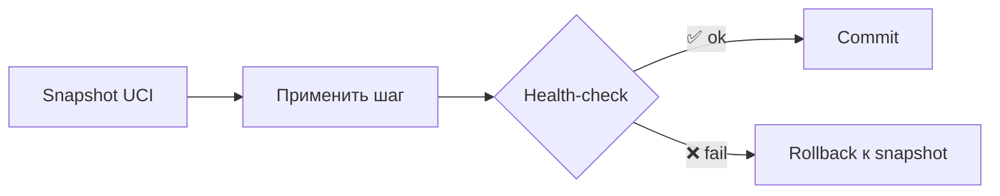
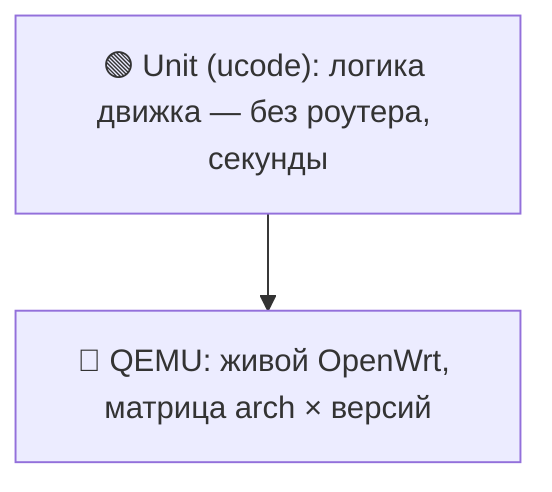

# Надёжность — три кирпича

> [!tip] TL;DR
> Сознательно **не** строим generic desired-state движок (это путь Ansible — годы и команды,
> и источник скрытых багов). Вместо него — три простых механизма, каждый понятен целиком:
> **preflight · идемпотентные шаги · точечный rollback**. Простота = надёжность.

## Почему не generic-движок

Полноценный reconciler звучит красиво, но для соло-мейнтейнера это over-engineering: годы
разработки, а полу-готовая абстракция **прячет** баги и оказывается ненадёжнее простых шагов.
Принцип проекта: *надёжным делаем только то, что держим в голове целиком.*
Подробный разбор размена — [[0001-why-not-singbox]] (та же философия «без чёрных ящиков»).

## Кирпич 1 — Preflight (гейткипер)

Перед **любыми** изменениями движок проверяет железо и отказывает с понятной ошибкой:

| Проверка | severity | Зачем |
|---|---|---|
| arch ∈ поддерживаемых | hard | бинарь зависимостей существует |
| версия OpenWrt ≥ 25.12 | hard | API/пакеты совместимы |
| свободный флеш / RAM ≥ порога | **soft** | стек влезет и не упадёт |
| **зависимости устанавливаются** (`kmod-amneziawg`, `https-dns-proxy`…) | hard | **главный чек** |
| нет конфликта LAN/WAN | hard | не отрезать себе доступ |

Это заменяет «список поддерживаемых моделей»: не тестируем каждую модель, а честно проверяем
требования. См. [[hardware-requirements]].

**Гейткипер — не тупик.** Провалы железа-впритык (флеш/RAM) помечены `soft`: установка может
пройти, а упавший шаг откатится кирпичом 3. Провалены **только** они → владелец вправе установить
как есть (`install.accept_risk` → `check.uc --allow-soft`), получив объяснение последствий и
безопасных альтернатив. `hard` не пропускается никогда: без нужной arch/версии/пакетов `apk`
не найдёт файлы, и «риск» обещал бы невозможное. Решение фиксируется (`install.json.forced`,
предупреждение в логе, плашка в панели) — иначе разбор жалоб начинается с гадания о железе.

## Кирпич 2 — Идемпотентные шаги

Установка — набор шагов (vpn, dns, doh, wifi, firewall). **Каждый можно запустить дважды
без вреда**: шаг сам проверяет «уже сделано? → пропустить». Повторный запуск **чинит**, а не
ломает. Нет глобального «состояния системы» — каждый шаг самодостаточен.

> [!example] Идемпотентность на практике
> Перед `uci add` — удалить существующее правило с тем же именем. Перед добавлением cron —
> `grep -v PATTERN`. Иначе повторная установка плодит дубликаты.

> [!important] Состояние ядра должно переживать пересборку, а не только запись
> Идемпотентности «применил один раз правильно» мало, если что-то снаружи сбрасывает состояние.
> nftables-правила split-routing и kill-switch мы кладём в `/etc/nftables.d/`, откуда **fw4
> восстанавливает их при каждом `reload`** — а не инъектируем командой `nft add`. Иначе любой
> `fw4 reload` (поднятие интерфейса, установка пакета, правка LuCI, ребут) стирал бы их молча.
> Правило надёжности: спрашивай не только «повторный запуск не навредит?», но и «что
> восстановит это состояние, если система пересоберёт его без нас?». См. [[kill-switch]].

> [!warning] Шрам: у пути наружу должен быть фолбэк (2026-08-22)
> Маршрут туннеля ставил proto-handler AWG (`route_allowed_ips='1'`) — ОДИН `default dev awg0`,
> который **замещал** WAN-дефолт (тот же prefix, та же метрика) и обратно его не возвращал. В
> `main` оставался **ровно один** дефолт, и принадлежал он туннелю. Дальше любое исчезновение
> `awg0` — `ifdown` кнопкой «перезапустить туннель» в панели, сбой netifd, смена протокола —
> оставляло роутер **вообще без маршрута наружу**: ни LAN, ни сам роутер (а значит и DoH, и
> `apk`, и повторный подъём туннеля по имени хоста) никуда не идут. Само это не чинится: нужен
> ребут или ручной `ifup wan`. Воспроизведено в QEMU на сыром uci, без участия движка.
>
> Исправление — **half-routes** `0.0.0.0/1` + `128.0.0.0/1` (`::/1` + `8000::/1`), как у Full-тира:
> они специфичнее WAN-дефолта, поэтому побеждают его **не удаляя**. WAN-дефолт остаётся в `main`
> постоянным фолбэком: туннель ушёл — роутер по-прежнему в сети, а LAN защищает [[kill-switch]]
> (не-direct трафик дропается, а не утекает). Побочно: `--teardown` больше не дёргает `ifup wan`
> вслепую, а `network restart` в `install/reset.uc` и `install/run.uc` из необходимости стал
> перестраховкой. Регресс-тест — `make qemu-route-fallback` (проверка 4 — ровно этот случай).
>
> Общее правило: **у маршрута наружу всегда должен быть владелец «по умолчанию»**, переживающий
> падение любого туннеля. Если состояние держит ровно один компонент и его исчезновение никем не
> компенсируется — это не отказоустойчивость, а одна точка отказа с красивым именем.

## Кирпич 3 — Точечный rollback



UCI-конфиги откатываются чисто → на них транзакция со snapshot.

> [!warning] Честность важнее красивой абстракции
> Операции с **грязным откатом** (загруженный kmod, изменённое состояние сети) **не маскируем
> под транзакцию**. Для них — честный **safe-fail + понятная ошибка пользователю**, а не
> иллюзия отката. Притворяться, что откатили то, что не откатывается — хуже, чем честно сказать.

## Сквозной: один список инвариантов

Три кирпича выше защищают **момент установки**. Роутер живёт годами после, и знание «что должно
быть на месте, чтобы он работал» было размазано по тестам, шагам и голове мейнтейнера. Именно
поэтому оба инцидента 2026-08 прожили при полностью зелёных тестах: каждый кусок по отдельности
был правильным, а систему целиком не проверял никто.

Список живёт в `engine/invariants/` — чистая оценка + импурный сбор + CLI, как у preflight:

```sh
ucode -R gather.uc | ucode -R check.uc      # exit 0 = отклонений нет
```

У списка **четыре потребителя**: диагностика (печатает чек-лист первой секцией — разбор жалобы
начинается с «что не на месте»), QEMU-тесты (утверждают ровно эти инварианты), **сторож**
(`engine/watchdog`, cron раз в 5 минут: чинит по `--repairs`, за тик не больше одной починки,
молчит при норме и сдаётся после трёх неудачных попыток) и позже панель. Новый инвариант
добавляется в ОДНОМ месте — и его сразу и проверяют, и чинят, и показывают.

> [!note] И один выход для человека
> Все три кирпича и сторож защищают систему. Аварийный режим (`install/pause.uc`, кнопка в
> панели) защищает **человека**: туннель не поднять — одна кнопка возвращает интернет, вторая
> возвращает защиту, конфигурация цела. Флаг `paused` уважают и сторож, и переприменение при
> подъёме WAN: решение владельца не отменяется за его спиной. Подробно — [[kill-switch]].

> [!tip] Правило, которое стоит держать
> Каждый оплаченный инцидент оседает **в списке**, а не только в комментарии рядом с кодом.
> Комментарий объясняет «почему так написано»; инвариант — проверяет, что так и осталось.

## Поверх всего: fail-safe направление

Архитектурный выбор «дефолт-туннель» означает, что даже при сбое логики трафик уходит в VPN,
а не утекает. См. [[split-routing#Почему направление именно «дефолт-туннель»]] и [[kill-switch]].

> [!note] Единственное осознанное исключение — окно ДО первого commit (2026-08-19)
> Half-routes (туннель = дефолт) вооружались сразу внутри туннель-шага (`vpn`/`singbox`),
> задолго до `health-check` — то есть весь дом переключался на непроверенный туннель и терял
> интернет на 15–30+с при любом сбое (живой инцидент: несовместимость xray-core/sing-box).
> Владелец проекта явно решил: на **первой** установке (до первого commit ещё нечего защищать
> — трафик и так шёл открытым WAN) вооружение откладывается до подтверждения health-check
> (`apply.uc --no-arm` → health-check → `apply.uc --arm`, `install/run.uc`). «Заменить сервер»/
> «переключить протокол» (`replace_vpn.uc`, `replace_singbox.uc`) это исключение НЕ затрагивает
> — там уже работающий с прошлой установки kill-switch защищает непрерывно, откладывать нечего.
> Инвариант «дефолт-туннель, не утекать» **не отменён** — сузена ровно одна граница, где ему
> ещё нечего защищать.

> [!note] Осознанное исключение №2 — резервный путь для DNS (2026-08-23)
> «Дефолт-туннель» знает ровно одно исключение помимо direct-списка: **резервный экземпляр
> DoH-прокси**, который уходит мимо туннеля и включается, только когда основной молчит. Без него
> смерть туннеля уносила с собой ВЕСЬ резолв — не открывались даже домены из direct-списка, а
> панель при этом обещала обратное. Исключение сужено до предела: другой экземпляр того же
> провайдера, отдельный владелец сокета, `strict-order` (в норме им не пользуются вовсе), и в
> режиме «в поездке» его нет совсем — там fail-closed. И главное: панель **говорит**, когда DNS
> идёт резервным путём. Механика и размен — [[encrypted-dns]], проверка — `make qemu-dns-fallback`.

## Пирамида тестов



CI: lint + unit → сборка пакета (OpenWrt SDK, матрица arch) → boot в QEMU (проверка split и
корректных отказов preflight) → при теге публикация ассета в GitHub Release. **Тестируем
архитектуры, не модели.**

## Дальше

- [[engine-ucode]] — где живут эти кирпичи
- [[hardware-requirements]] — что проверяет preflight
- [docs/architecture.md](../../architecture.md) — полный дизайн
