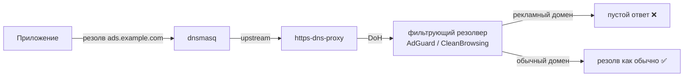

# Блокировка рекламы и контента — выбором DNS-провайдера

> [!tip] TL;DR
> Реклама грузится с известных доменов. Если DNS **не отвечает** на эти домены — реклама не
> загружается для всех устройств в сети сразу. Мы делаем это **не локальным списком на роутере**,
> а **выбором фильтрующего DoH-резолвера**: провайдер (по умолчанию AdGuard) сам не отдаёт
> рекламные/трекерные ответы. Почему так, а не adblock-lean — [[0005-dns-filtering-not-local-adblock]].

## Принцип

Весь DNS в сети и так идёт через [[encrypted-dns|https-dns-proxy]] на роутере — значит
«фильтрация» сводится к тому, **какой upstream-резолвер выбран**. (Экземпляра два — основной и
резервный, — но провайдер у них ОДИН: уровень фильтрации не меняется от того, каким путём ушёл
запрос. Зачем второй — [[encrypted-dns]].) Фильтрующие публичные
DoH-резолверы (AdGuard, CleanBrowsing) держат свои блок-листы на своей стороне и просто не
отдают адрес рекламного/трекерного (а «семейные» — и взрослого) домена.



## Категории = классы фильтрации

Каталог провайдеров ([providers.uc](../../../engine/steps/doh/providers.uc)) размечен по классам —
пользователь выбирает по короткому описанию в мастере (Setup) и панели (Status):

- **`plain`** — без фильтрации рекламы: Cloudflare ничего не режет, Quad9 блокирует только вредоносные сайты.
- **`ads`** — реклама + трекеры (**AdGuard — дефолт**): полезно и почти ничего не ломает.
- **`family`** — плюс 18+ и безопасный поиск (AdGuard Семейный, CleanBrowsing Семейный):
  «семейный режим» = выбрать такого провайдера, он сам форсит SafeSearch на стороне DNS.

Смена — ubus-метод `set_dns_provider(id)` (enum из каталога — граница доверия): движок
переписывает обе секции — `cheburnet_doh` и резервную `cheburnet_doh_wan` (delete-before-set,
идемпотентно; провайдер у них всегда один — иначе фильтрация молча менялась бы при аварии).

## Почему на уровне роутера, но не локальным списком

- **Одно место на всю сеть** — работает для телефонов, смарт-ТВ, IoT, где adblock не поставить,
  без приложений на каждом устройстве.
- **Почти без цены** — фильтрует провайдер, а не блок-лист в RAM (15–40 МБ у adblock-lean били
  по самому слабому тиру, ломали `apk add`). Полное сравнение с локальным adblock-lean —
  [[0005-dns-filtering-not-local-adblock|ADR 0005]].

## Место в цепочке DNS

Локально dnsmasq делает только [[dnsmasq-nftset|пометку адресов]] для split-routing; блокировка
и шифрование — на стороне https-dns-proxy и выбранного резолвера:

```
Клиент → dnsmasq [nftset-пометка] → https-dns-proxy → фильтрующий DoH-резолвер
```

## Честный размен

> [!note] Что принимаем
> Резолвер видит запросы (тот же размен, что и у любого DoH), тонкого локального whitelisting'а
> нет, CDN-реклама на общем домене не режется. Полный разбор —
> [[0005-dns-filtering-not-local-adblock]].

## Дальше

- [[encrypted-dns]] — шифрование в той же цепочке (и выбор резолвера)
- [[0005-dns-filtering-not-local-adblock]] — почему провайдер, а не локальный adblock-lean
- [[data-plane]] — общая картина DNS + маршрутизации
