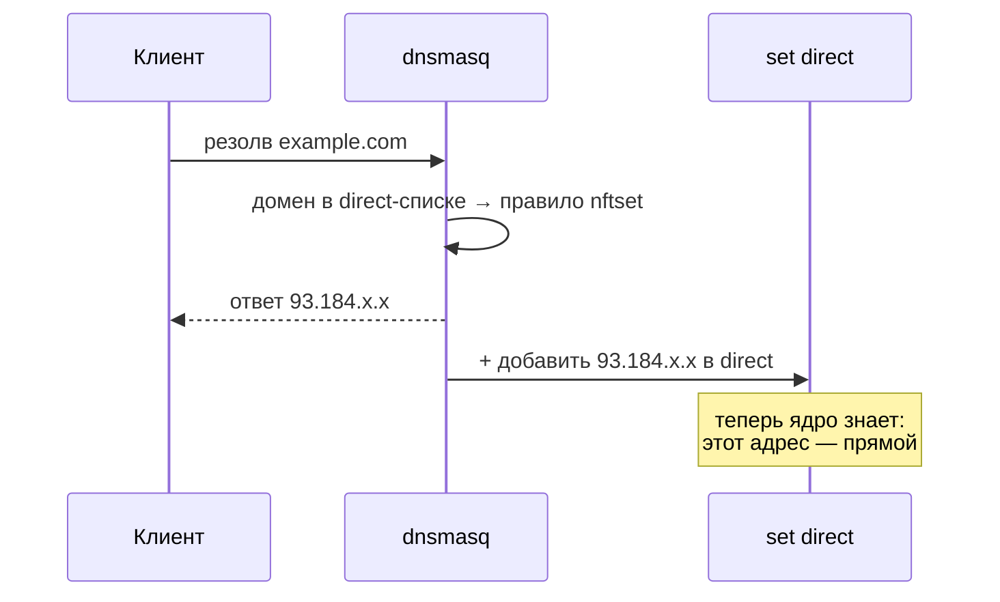

# dnsmasq-nftset — как DNS помечает адреса

> [!tip] TL;DR
> dnsmasq умеет: «если резолвится домен из списка — положи полученный IP в nftables-множество».
> Это и есть мост [[split-routing|домен → IP]]. Директива — `nftset`.

## Что такое nftset

`nftables` (фаервол OpenWrt, таблица `inet fw4`) поддерживает **именованные множества** (sets) —
динамические наборы адресов. dnsmasq может **наполнять** такое множество на лету: при резолве
домена из заданного списка он добавляет ответный IP в set.

Объявляем множество (адреса IPv4 и IPv6):

```
# nftables: множество для «прямых» адресов
nft add set inet fw4 direct  { type ipv4_addr\; flags interval\; }
nft add set inet fw4 direct6 { type ipv6_addr\; flags interval\; }
```

## Связываем домены с множеством

Сырая директива dnsmasq выглядит так (её и генерирует init-скрипт в итоговый конфиг):

```
# формат: /<домен>/<семейство>#<таблица-family>#<таблица>#<имя-set>
nftset=/example.com/4#inet#fw4#direct
nftset=/ru/6#inet#fw4#direct6        # матчится по СУФФИКСУ: TLD-запись покрывает всю зону
```

Но в UCI (OpenWrt: `/etc/config/dhcp`) её **нельзя** записать как `list nftset` в секции
dnsmasq — init-скрипт такую строку молча игнорирует (проверено на живом OpenWrt 25.12; тихий
отказ, который не ловится юнитами). Правильная UCI-модель — отдельная секция `config ipset`,
из которой init сам собирает директиву:

```
# /etc/config/dhcp
config ipset 'cheburnet_dns4'
	option table 'fw4'
	option table_family 'inet'
	option family '4'          # явно! иначе init выводит семейство через `nft list set`,
	                           # а на свежей установке сета ещё нет — вывод молча провалится
	list name 'direct'
	list domain 'ru'           # TLD-запись: все *.ru одной строкой
	list domain 'example.com'  # и/или конкретные домены
```

Домены матчатся по суффиксу: запись `ru` покрывает `example.ru` и все его поддомены.
Что попадёт в список — задаёт пользователь.

> [!warning] IDN-домены — это punycode
> Не-ASCII домены в DNS представлены в punycode (`xn--...`). Если в direct-список нужны такие
> домены — матчить надо их punycode-форму, а не юникод.

## Что происходит в рантайме



После этого любой пакет на `93.184.x.x` ядро увидит в множестве `direct` и отправит
напрямую — см. [[policy-routing]].

## Почему это лучше FakeIP/sing-box для нашей задачи

sing-box решает ту же задачу через FakeIP (выдаёт фейковый `198.18.x.x` и перехватывает) —
мощно, но это чёрный ящик и тяжёлый бинарь. nftset обходится без отдельного демона: только
dnsmasq + ядро, каждый шаг виден. Полный размен (footprint, образовательность, обход DNS
клиентом, общие CDN-IP) — [[0001-why-not-singbox]] и
[[split-routing#Зависимость от того, что клиент использует НАШ DNS]].

## Где это живёт в проекте

Генерацией `nftset`-строк и объявлением множеств занимается [[engine-ucode|движок]]
(модуль `engine/routing/`), на основе пользовательского/импортированного списка
(см. [[architecture-overview]]).

## Дальше

- [[policy-routing]] — как ядро использует множество
- [[encrypted-dns]] — DNS при этом ещё и зашифрован
