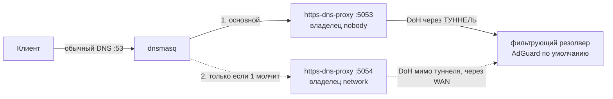

# Зашифрованный DNS (DoH)

> [!tip] TL;DR
> Обычный DNS идёт открытым текстом — провайдер видит, какие сайты ты резолвишь, и может
> подменять ответы. **DoH (DNS over HTTPS)** шифрует резолв. У нас его обеспечивает лёгкий
> демон `https-dns-proxy` перед dnsmasq.

## Проблема обычного DNS

DNS по умолчанию — это UDP/53 открытым текстом. Последствия:

- **Приватность:** любой на пути (провайдер, публичный Wi-Fi) видит каждый домен, который ты
  запрашиваешь — даже если сам сайт по HTTPS.
- **Целостность:** DNS-ответ по открытому каналу можно перехватить и подменить (man-in-the-middle).

## Решение: DoH

**DNS over HTTPS** заворачивает DNS-запросы в обычный HTTPS к доверенному резолверу
(например, Quad9 `9.9.9.9`). Снаружи это неотличимо от обычного web-трафика → нельзя ни
прочитать, ни подменить.

## Как встроено у нас

В v1 DoH давал sing-box. В v2 (без sing-box, см. [[0001-why-not-singbox]]) — отдельный
**лёгкий** демон `https-dns-proxy`:



- Клиент → **dnsmasq** (тут же [[dnsmasq-nftset|пометка адресов]] для split-routing).
- dnsmasq форвардит upstream-запросы в **https-dns-proxy** (локально, :5053).
- https-dns-proxy шифрует и шлёт в выбранный резолвер по HTTPS.

## Почему экземпляров ДВА

> [!warning] Оплачено симптомом «интернет пропал совсем» (2026-08-23)
> Вся цепочка резолва уходила **в туннель**: сокеты роутера идут по main-таблице, а пометка
> `direct` живёт в prerouting и локального трафика не касается. Значит туннель умер → DoH
> недостижим → dnsmasq без upstream → **не резолвится ничего**, включая домены из direct-списка.
> Их адреса не попадают в nft-набор, не помечаются и режутся [[kill-switch|kill-switch'ем]]. При
> этом панель обещала «открываются только сайты из списка напрямую» — обещание было ложным.
> Тот же исход давал упавший `https-dns-proxy` (он умеет падать: `c-ares needed more IO event
> handler` — фатальная ошибка внутри демона; procd его поднимает, но окно без DNS есть).

Отсюда **два экземпляра одного и того же провайдера**:

| | порт | владелец | путь наружу | когда используется |
|---|---|---|---|---|
| основной | 5053 | `nobody` | **через туннель** | всегда, пока отвечает |
| резервный | 5054 | `network` | мимо туннеля, через WAN | только когда основной молчит |

Провайдер у них ОДИН: иначе в аварии молча менялся бы уровень фильтрации (семейный фильтр
расфильтровался бы ровно тогда, когда никто не смотрит).

### Как резервный уходит мимо туннеля

Правилом [[policy-routing|policy routing]] **по владельцу сокета**:

```
ip rule add uidrange 101-101 lookup 100   # 101 = uid пользователя network
```

> [!important] Почему по владельцу, а не пометкой в nft
> Пометка в `output`-хуке для этого **не работает**: сокет выбирает src-адрес при `connect()`,
> то есть ДО хука. Пакет уходит в WAN с адресом туннеля, ответ не возвращается. Правило по
> владельцу учитывается уже при выборе маршрута, поэтому и маршрут, и src берутся WAN'овские.
> Проверено в QEMU (`make qemu-dns-fallback`, там же отрицательный контроль: снимаешь правило —
> резолв умирает).

### Порядок обязателен

`dnsmasq` по умолчанию опрашивает upstream'ы **наперегонки** и предпочитает тех, кто быстрее.
Резервный (через WAN) почти всегда быстрее туннельного — то есть без дополнительной меры DoH
уходил бы мимо туннеля **постоянно**, а не только в аварии. Поэтому шаг ставит
`strictorder=1`: спрашивать строго по порядку, резервный — только если основной молчит.

### Чем платим — честно

**В норме** ваши DNS-запросы идут только туннелем: резервный экземпляр молчит, пока основной
отвечает. Но полностью невидимым он не становится — раз в час он сам перепроверяет адрес
резолвера, и этот служебный запрос уходит его путём, мимо туннеля. Провайдер по нему может
понять, что роутер пользуется, например, AdGuard DNS. **Ваших доменов он при этом не видит.**
Поэтому интервал и поднят с пакетных 120 секунд до часа (`polling_interval`, см. `providers.uc`):
меньше сигналов — но обещать «ноль» было бы неправдой.

**В аварии** провайдер дополнительно видит сам факт обращений к резолверу; запросы остаются
зашифрованными, домены по-прежнему не видны. Резолв в этом режиме медленнее: каждый новый домен
ждёт, пока замолчит основной upstream. Панель об этом состоянии **говорит прямо** — молчаливая
деградация приватности недопустима.

**Плата железом** — второй процесс: ~2,9 МБ RSS (замер в QEMU) при пороге preflight 112 МБ.

> [!note] В режиме «в поездке» резервного пути НЕТ — намеренно
> `travel` означает «наружу не уходит ничего мимо туннеля», и DNS не исключение: в чужом Wi-Fi
> лучше остаться без резолва, чем засветить домены. Правило `uidrange` в этом режиме не ставится
> (см. `render_iprules` в `engine/routing/routing.uc`). Это fail-closed, и это осознанно.

Так мы совмещаем три вещи в одной цепочке DNS: **пометка для split-routing** (dnsmasq),
**шифрование upstream** (https-dns-proxy) и **[[adblock|фильтрацию рекламы/контента]]** (на
стороне выбранного резолвера, а не локальным списком — [[0005-dns-filtering-not-local-adblock]]).

> [!note] Почему именно так, а не «DoH на клиенте»
> Если каждое устройство делает свой DoH — мы теряем [[dnsmasq-nftset|пометку адресов]]
> (роутер не видит резолв) и общий выбор фильтрующего резолвера. Централизованный DNS на роутере
> даёт и приватность, и наши функции. Размен описан в [[split-routing#Зависимость от того, что клиент использует НАШ DNS]].

### Кто владеет конфигом dnsmasq

Пакет `https-dns-proxy` умеет сам править dnsmasq (`dnsmasq_config_update`). Мы отключаем эту
функцию и держим привязку своими руками — один владелец конфига, upstream dnsmasq остаётся
**только** выбранный резолвер.

> [!warning] Баг апстрима: на молчащих bootstrap-серверах демон уходит в crash-loop
> `[F] dns_poller.c:39 c-ares needed more IO event handler, than the number of provided
> nameservers: N` — фатальная ошибка ВНУТРИ `https-dns-proxy`. **Триггер найден и воспроизводится
> стабильно:** bootstrap-серверы не отвечают (не «отказ», а именно молчание) — ретраи c-ares
> копят сокеты, и демон умирает целиком. `procd` перезапускает его 5-6 раз и объявляет crash-loop.
>
> Для нас это значит вот что: **при мёртвом туннеле основной экземпляр обречён** — его запросы
> уходят в туннель и молчат. Резервный при этом жив (он ходит мимо туннеля) и несёт весь резолв.
> То есть без второго экземпляра мёртвый туннель уносил бы DNS не «иногда», а **всегда**.
>
> Конфигурацией не лечится: пул обработчиков выделяется по числу bootstrap-адресов, но и с 4, и с
> 6 адресами (дубли v4, пара v6) результат тот же — 6 падений и crash-loop (замер в QEMU
> 2026-08-23). Поэтому инвариант `dns_main` **не имеет автопочинки**: перезапускать демон, пока
> туннель мёртв, значит бить в стену. Он возвращается сам, когда возвращается туннель.

> [!warning] Шрам: чужой экземпляр выживал и занимал наш порт (2026-08-23)
> Пакет кладёт свои экземпляры **анонимными** секциями (`@https-dns-proxy[0]`, `[1]`), а удаление
> анонимной секции **сдвигает индексы**: снёс `[0]` — бывший `[1]` стал `[0]`, и второй `delete`
> промахивается. Один чужой экземпляр (`dns.google`) выживал и занимал порт `5054` — тот самый, на
> котором должен слушать наш резервный. То есть резервный DNS молча уходил бы к чужому резолверу
> **мимо выбранной пользователем фильтрации**. Лечение: анонимные секции сносим в ОБРАТНОМ порядке
> индексов и до именованных (`doh.uc`), а тест проверяет не только число экземпляров, но и чей
> резолвер у каждого (`make qemu-dns-fallback`).

> [!warning] Шрам: пакет тихо возвращал сток-DNS после каждого ребута
> Пакет при установке сохранил «как было» в служебных ключах (`doh_backup_noresolv`,
> `doh_backup_server`) и при каждой остановке — включая ребут — восстанавливал dnsmasq по ним,
> даже после того как мы отключили его собственное управление. Split-routing и kill-switch
> продолжали работать, панель была зелёной — признаков поломки не было, а шифрование DNS уже не
> работало. Исправление: doh-шаг **снимает и служебные ключи**, а не только свою запись —
> восстанавливать нечего. Найдено `make qemu-reboot` (2026-07-31).

## Выбор резолвера

По умолчанию — **AdGuard** (реклама+трекеры: полезно и почти ничего не ломает). В каталоге
([providers.uc](../../../engine/steps/doh/providers.uc)) есть и «чистые» (Quad9, Cloudflare), и
«семейные». Пользователь не обязан в этом разбираться; продвинутый — меняет одним выбором
(`set_dns_provider`). Заодно этот выбор и есть [[adblock|фильтрация]] — см. [[0005-dns-filtering-not-local-adblock]].

## Дальше

- [[adblock]] — блокировка рекламы/контента = выбор резолвера в той же цепочке
- [[dnsmasq-nftset]] — пометка адресов в той же цепочке
