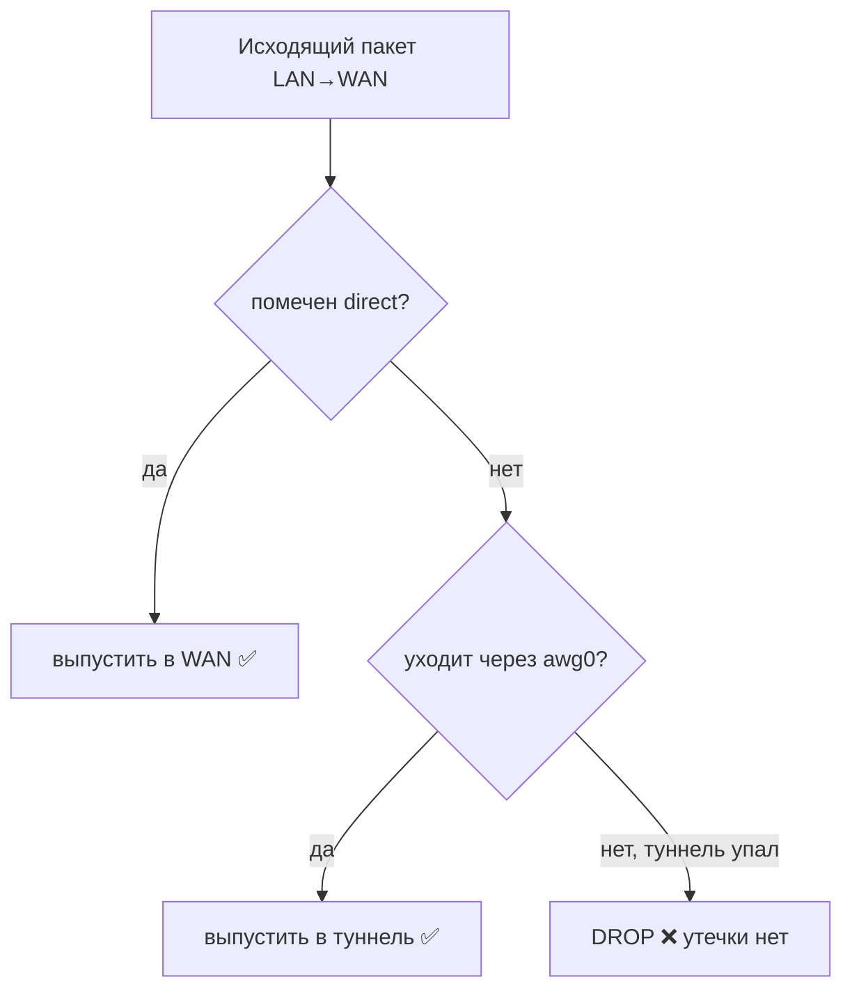

# Kill-switch — защита от утечки

> [!tip] TL;DR
> Если [[amneziawg|туннель]] упал, трафик, который должен идти в VPN, **не должен утечь
> напрямую через WAN**. Kill-switch — это nftables-правила, которые роняют такой трафик,
> пока туннель не восстановится.

## Зачем

Без kill-switch при падении туннеля ядро может попытаться отправить «туннельный» трафик
обычным путём (через WAN). Это **утечка**: твой реальный IP и трафик уходят в открытую,
ровно тогда, когда ты этого меньше всего ждёшь. Для нашей угрозы-модели это недопустимо.

## Принцип

> Правило: **трафик, не помеченный как [[policy-routing|прямой]] (`direct`), имеет право
> покинуть роутер только через `awg0`.** Любая попытка уйти в WAN мимо туннеля — drop.



Пример правила (упрощённо):

```
# выпускаем напрямую только помеченное; туннельное — только через awg0; иначе drop
oifname "wan" meta mark != 0x1 ct state new drop
```

> [!important] Правило живёт в `/etc/nftables.d/`, а не инъектируется командой
> Наши цепочки (`cheburnet_mark`, `cheburnet_ks`) и правила лежат в файле
> `/etc/nftables.d/10-cheburnet.nft`, который **fw4 включает в таблицу `inet fw4` при каждом
> `reload`**. Это не косметика: если инъектировать правила императивно (`nft add rule …`),
> **любой** `fw4 reload` — а его дёргает поднятие интерфейса (hotplug awg0 прямо во время
> установки!), установка пакета, правка в LuCI, перезагрузка — **стирает** их, и kill-switch
> тихо умирает. Через `nftables.d` reload наоборот **восстанавливает** правила. Урок оплачен
> живым прогоном на роутере: цепочки оставались, но пустели после reload — «зелёная» система
> без защиты. См. [[reliability]].

## Почему это «осознанный слой», а не паранойя

> [!important] Инвариант из v1
> Kill-switch легко принять за «лишнюю сложность» и захотеть упростить. **Не делай этого, не
> перечитав threat model.** Весь смысл проекта — приватность; дырявый kill-switch обнуляет её
> молча (всё «работает», но утекает).

Распространённая ошибка — **хардкод LAN-подсети** (`192.168.1.0/24`) в правилах. На
нестандартной подсети это делает kill-switch тихо-дырявым. CIDR определяем динамически,
не хардкодим (урок из v1).

## Связь с режимами

В **TRAVEL** (full tunnel) исключений `direct` нет вовсе → kill-switch строже: вообще
всё, кроме awg0, под запретом. См. [[home-travel-modes]].

## Единственное исключение — окно первой установки до commit

На первой установке (не на замене сервера/переключении протокола) вооружение half-routes
отложено до подтверждения `health-check` — см. [[reliability#Поверх всего: fail-safe
направление]]. До первого commit защищать ещё нечего: трафик и так шёл открытым WAN, VPN
ещё не существовал. Kill-switch как таковой (правила в `/etc/nftables.d/`) это не касается —
он применяется firewall-шагом как и раньше, последним; откладывается только момент, когда
сам туннель-шаг переключает на себя маршрутизацию.

## Аварийный выход — осознанный и обратимый

Kill-switch делает ровно то, что обещает: туннеля нет — трафика нет. Но у неспециалиста это
превращается в тупик, если туннель не поднять (сервер выключили, ключ просрочен, провайдер режет
протокол): интернета нет, а до причины из панели не дотянуться. Раньше выходов было два — SSH или
`factory_reset`, то есть снести настройку целиком.

Поэтому в панели есть **аварийный режим** (`install/pause.uc`, ubus `pause_protection`): одна
кнопка снимает маршрут туннеля и правила защиты, и интернет идёт напрямую. Он устроен так, чтобы
не стать дырой:

- **обратим одной кнопкой** — конфигурация (ключи, endpoint, домены) не трогается вообще;
- **виден** — панель держит красный баннер «защита выключена», диагностика печатает это первой
  строкой. Молча снятая защита была бы хуже отсутствия кнопки;
- **не отменяется за спиной** — флаг `paused` живёт в `install.json`, его уважают
  [[reliability|сторож]] (не «чинит» снятую защиту) и переприменение при подъёме WAN. Иначе
  человек нажал бы кнопку, а через 5 минут снова остался без интернета, ничего не сделав;
- **предлагается последним** — кнопка появляется в панели только когда туннель действительно не
  работает, после «перезапустить» и «вставить свежий конфиг».

Проверяется целиком: `make qemu-emergency`.

## Проверка

```bash
nft list ruleset | grep -A5 forward   # увидеть правила drop
# тест: погасить awg0 и убедиться, что непрямой трафик не идёт в WAN
```

## Дальше

- [[policy-routing]] — как формируется пометка, на которую опирается kill-switch
- [[home-travel-modes]] — поведение в разных режимах
