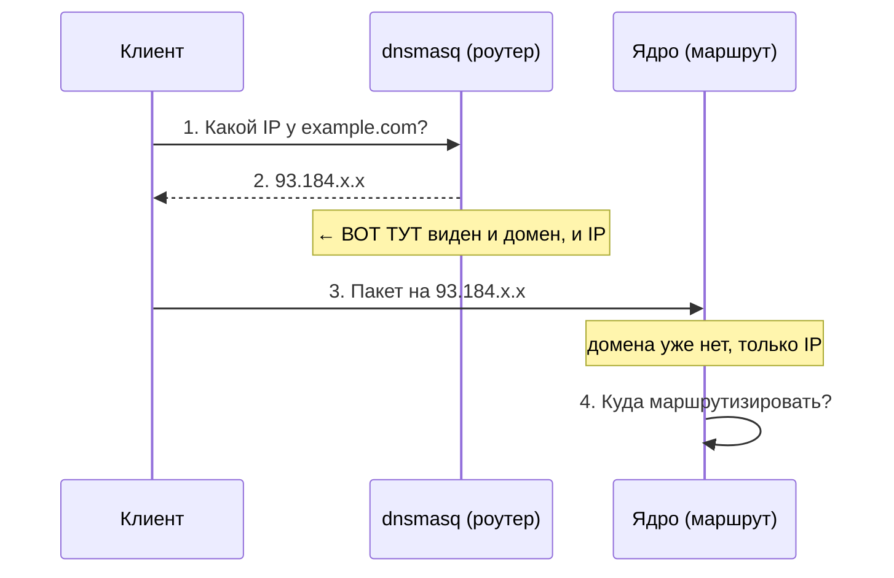

# Split-routing — раздельная маршрутизация

> [!tip] TL;DR
> «Часть трафика — в туннель, часть — напрямую». Сложность одна: **решение принимается по
> домену, а ядро маршрутизирует по IP-адресу.** Единственный момент, когда роутер видит и домен,
> и будущий IP одновременно, — DNS-резолв. Весь наш data-plane — мост между «доменом» и «адресом»,
> построенный в этой точке.

## Что это

Split-routing (split-tunnel) — роутер отправляет **разный трафик разными путями**. Пользователь
задаёт **список доменов прямого доступа** (direct-список), и роутер делит:

- Домены из **direct-списка** → **напрямую через WAN** (без туннеля): локальные сервисы, низкая
  задержка, сайты, которые иначе ведут себя через VPN (чувствительны к источнику соединения).
- Весь **остальной** трафик → **через зашифрованный [[amneziawg|VPN-туннель]]**.

Противоположность — «full tunnel», когда вообще всё идёт в VPN (наш режим TRAVEL,
см. [[home-travel-modes]]).

> [!note] direct-список — это пользовательская настройка
> Что попадёт в direct-список — решает пользователь (или импортируемый им community-список).
> Проект даёт **механизм** разделения, а не зашитый выбор «что куда».

## В чём фундаментальная сложность

**Пользователь думает доменами («открой `example.com`»), а ядро Linux маршрутизирует пакеты по
IP-адресам.** К моменту, когда пакет доходит до маршрутизатора ядра, домена уже нет — есть только
IP назначения, а принадлежность к direct-списку — свойство *домена*.

Шаг 2 — **золотая точка**: dnsmasq знает, что `example.com` резолвится в `93.184.x.x`. К шагу 4
домен потерян. Значит, всё, что зависит от домена, надо решить **на шаге 2**.

## Как мы это решаем

Раз на шаге 2 виден домен — пусть dnsmasq не только ответит клиенту, но и **запомнит**: «адрес
`93.184.x.x` принадлежит домену из direct-списка → пометить как прямой». Технически пометка — запись
IP в **nftables-множество** `direct`; потом её прочитает ядро на шаге 4.

1. [[dnsmasq-nftset]] — dnsmasq при резолве домена из списка кладёт его IP в множество `direct`.
2. [[policy-routing]] — ядро смотрит: адрес в `direct`? → напрямую; иначе → в туннель.

Это **классический способ OpenWrt**, проверенный годами; выбран вместо sing-box ради лёгкости и
наглядности — [[0001-why-not-singbox]].

**Почему нельзя просто «маршрутизировать по списку IP»:** IP меняются (CDN, переезды), один IP
обслуживает много доменов, а список огромен и устаревает. Домен — стабильный и осмысленный
идентификатор, поэтому решаем по домену в момент DNS, а IP-множество строим динамически.

## Почему направление именно «дефолт-туннель»

Критично для надёжности: **по умолчанию всё идёт в туннель**, а direct-список — это *исключения*.

> [!important] Fail-safe
> Если список неполон или клиент обошёл наш DNS — трафик просто пойдёт **через VPN** (работает,
> чуть медленнее), а **не утечёт** напрямую. Промах безопасен. Обратное направление («дефолт
> напрямую, часть в VPN») было бы опасным: промах = утечка.

## Зависимость от того, что клиент использует НАШ DNS

Условие подхода: клиент резолвит через dnsmasq роутера. Устройство со **своим DoH** (браузер,
смарт-ТВ с захардкоженным DNS) мы не видим — его домены из списка не попадут в `direct`, и оно
целиком пойдёт через туннель. Благодаря fail-safe это потеря «прямого пути», а не утечка.

## Дальше

- [[dnsmasq-nftset]] — как именно DNS помечает адреса
- [[encrypted-dns]] — как мы при этом ещё и шифруем DNS
- [[data-plane]] — как всё собрано вместе
